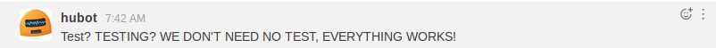
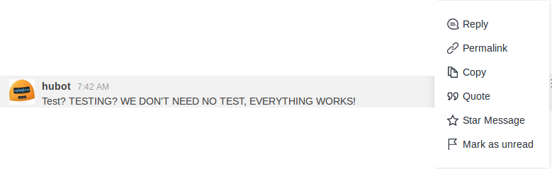
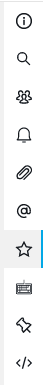
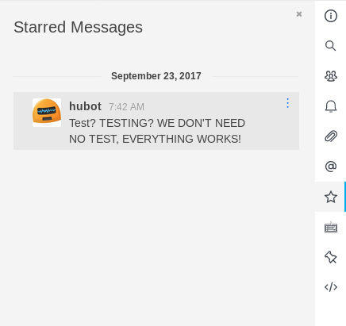
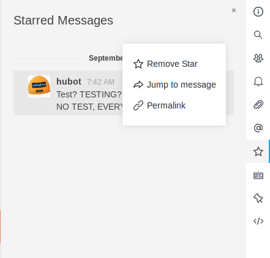
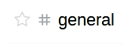
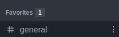

# Starring Messages

Star your favorite messages for __yourself__.

## What exactly does starring a message do?
Starring a message is similar to pinning a message, however starred messages are personal and only __you__ can see the messages you have starred. Starred messages are per chat room and are not global, each room has its own list of messages you have starred in that channel.

### Starring message in the channel

To star a message that interests you, go to the menu (the three dots on the right side) of the conversation:

You will see these options:

And choose the __"Star Message"__. Ready, your message was starred / favored!

When you search for messages that have been starred / favored, go to the right corner of your screen, in the menu options, you will have a star. Selecting it will open the list of messages that will be sorted by date and time.

To remove from the list of star messages just select from the conversation menu in the list and __"Remove star"__.

### Starring channel
To star a group, it is only to go in the name of the group that on the left side will appear the image of a star:

__Unstarring channel__

__Starring channel__

When a group is starred, a new topic in the left bar opens with the name "Favorites", making it easier to find the groups that are most interesting at the moment.

