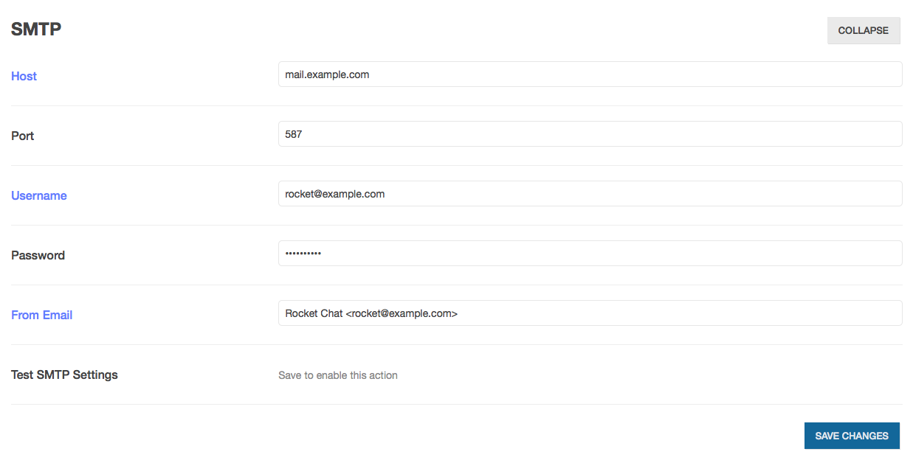

# Email Configuration

Rocket.Chat can send automated email notifications and other messages to your users.  To enable this, you will need to have access to an SMTP server and valid SMTP login credentials.

## Setup credentials
This is different depending on whether or not you're running Docker.

### Non-Docker

Go to Administration settings -> Email -> SMTP.  Enter your SMTP server's host name (e.g. `mail.example.com`), the port (usually 587 for modern, secured SMTP servers), and your credentials.  

### Docker
You'll need to set your this in your Dockerfile or docker-compose.yml (see `MAIL_URL` line).
```
  environment:
    - PORT=3000
    - ROOT_URL=https://chat.yourdomain.com
    - MONGO_URL=mongodb://mongo:27017/rocketchat
    - MAIL_URL=smtp://yourmailbox@yourdomain.com:yourpassword@smtp.yourmailserver.com:465/
```
Then go to Administration settings -> Email -> SMTP to continue.

### All installations
Enter a name and email to appear in the "From" field of the emails, click "Save changes", and *restart Rocket.Chat*.



## Test changes
Go back into the SMTP settings and click "Test SMTP settings". You should receive an email within a few minutes. If you do not, check the logs ("Administration -> View Logs") to see what went wrong. NB You might need to make sure Debug logging is on (default is to log Information only).
