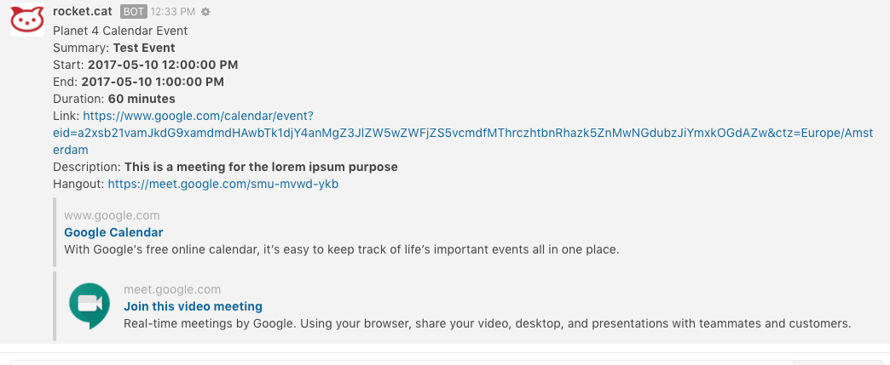

# Google Calendar

[Google Calendar](https://calendar.google.com/) is calendar from Google company. You can easily organize your daily tasks or meetings and share with your co-workers, etc..
This integration uses Rocket.chat incoming webhook.

Follow the install instructions here:

https://github.com/koyan/rocketchat-google-calendar

Screenshot with this integration:

