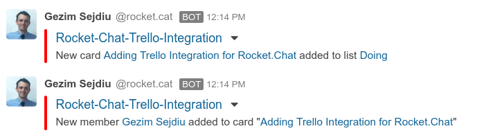

# Trello

[Trello](https://trello.com/) lets you work more collaboratively and get more done.Trello is the easy, free, flexible, and visual way to manage your projects and organize anything, trusted by millions of people from all over the world. Trello’s boards, lists, and cards enable you to organize and prioritize your projects in a fun, flexible and rewarding way.

This integration uses Rocket.Chat incoming webhook in order to send Trello activity notifications to Rocket.Chat channels.

Full documentation instructions here: 
https://github.com/gezims/Rocket.Chat-Trello-Integration
