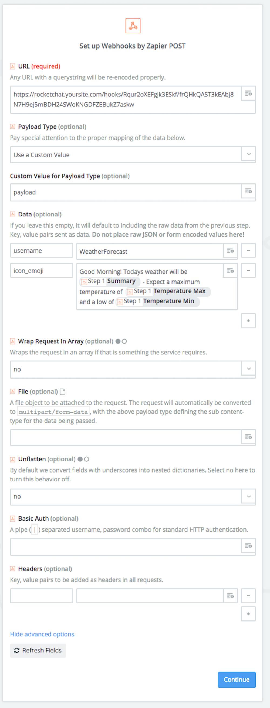

# Zapier
So, you're interested in connecting Zapier to Rocket.Chat? I have great news for you, the Rocket.Chat Zapier App is now in Beta via an invite! And guess what? You're invited!

Okay okay, before you get too excited there are a few things that we have to do before you accept the invite.

1. Check your Rocket.Chat version and then come back to me....
2. Now that you've got that, are you on `v0.49.3`? If **no**, then update is required before we proceed.
3. Is your server publicly accessible from the web? If **no**, Zapier requires it to be accessible via the web.
4. Log into your server, go to `Admin -> oAuth Apps -> Zapier`.
5. Change `Active` to be `True`
6. Change `Redirect URI` to be `https://zapier.com/dashboard/auth/oauth/return/App32270API/`
7. Click `Save Changes` then verify the save was successful.

Did you complete everything? Yes? Good! [Here is your invite (hint: click me)](https://zapier.com/dashboard/auth/oauth/return/App32270API/)!

## Manually Configuring a Zapier Zap
This will explain how to configure anything on Zapier to send to a WebHook integration in RocketChat. 

For this example we will use the 'Weather by Zapier' Trigger

1. Ensure that the endpoint for your chosen Zap is 'Webhooks by Zapier'
2. Select "POST" for the WebHook method. 
3. When you get to the "Set up Webhooks by Zapier POST" screen, Select "Show advanced options"
4. Configure with the following options:

**URL**: `Your Rocket.Chat Incoming WebHook/Integration URL` 

**Payload Type**: `Use a custom value` 

**Custom Value for Payload Type**: `payload` 

__*Data*__: Add 2 Custom Fields and configure like so:
 
**username**: WeatherForecast

**text**: Good Morning! Todays weather will be `{{zap_weather_summary_var}}` - Expect a maximum temperature of `{{zap_weather_max_var}}` and a low of `{{zap_weather_low_var}}`

**Wrap Request In Array**: no 

**Unflatten**: no

> Note: Make sure that the variables in the 'text' field are resolved correctly to the built in variablels available to the particular Zap you are using. 

> The rest of the options can be left blank if not specified above. 

