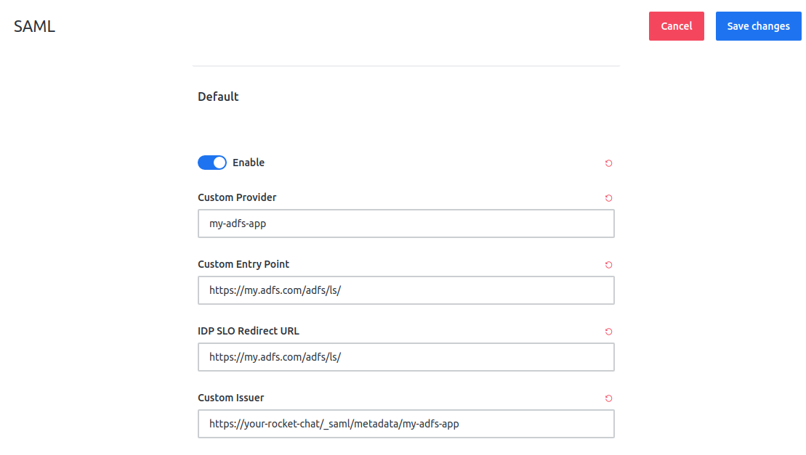
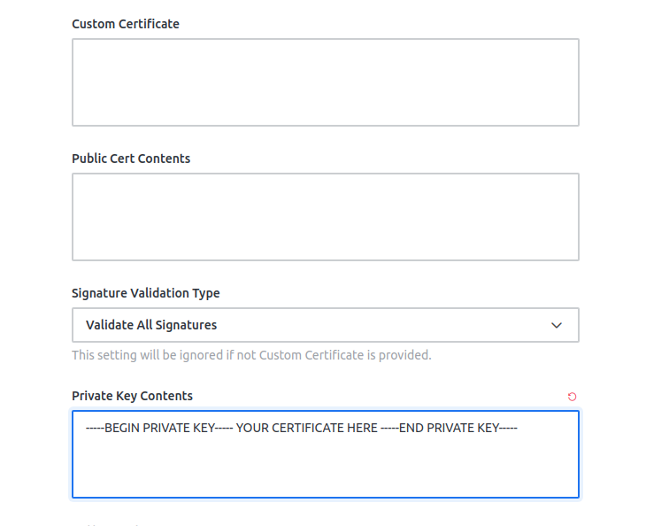
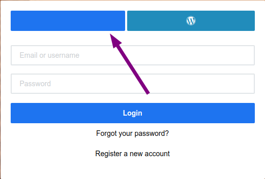

# Active Directory Federation Services

It is possible to setup the authentication between Rocket.Chat and Active Directory Federation Services by setting up SAML authentication scenario. 

Microsoft ADFS provides an IdP service which can be consumed by Rocket.Chat for authentication. Important: If you are using Active Directory _without_ Federation Services, you should perform the authentication via LDAP only.

The configuration should be done as follows:

1. Configure the entry points and the IdP path ****

2. Add the private key certificate related to the ADFS server.   
Important: ADFS uses .pfx certificate extensions \(widely used on Windows landscapes\) and Rocket.Chat uses .pem files. So, before setting the certificate here, it must be converted.

3. Set the _Custom Authn Context_ and _User Data Field Map_ according the scenario you have on your Active Directory

After that, the SAML configuration is done. The service will be available as a blue button above the login fields on Rocket.Chat login page

