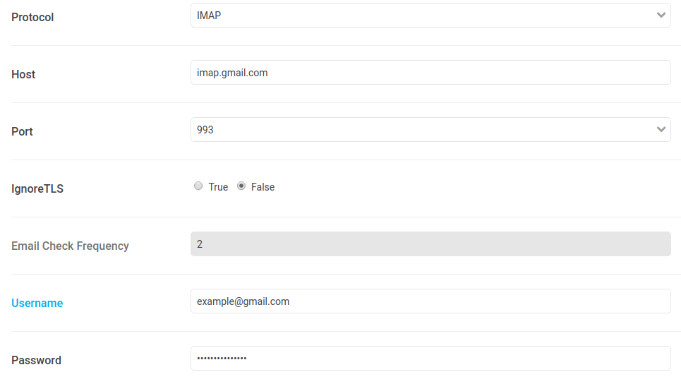

# Direct Reply [Email]

## Introduction

Enabling this feature will allow your users to reply to chat messages by directly replying to email notifications they receive. We are using [subaddressing](https://en.wikipedia.org/wiki/Email_address#Subaddressing) for this feature.

## Setup credentials

Go to Administration settings -> Email -> Direct Reply.

Enter:

- select email server's protocol (`IMAP` or `POP`)
- your email server's host name (e.g. `imap.example.com` or `pop.example.com`)
- the port (143 or 993 for IMAP and 110 or 995 for POP)
- ignore TLS `true` if port 143 or 110
- email check frequency (in minutes) if POP server (>=2)
- delete intercepted emails: select/keep `true` if you don't want to keep copy of email messages (in case IMAP server), recommended.
- Separator (default & recommended) is the character separating base & tag part of email. e.g. `base+tag@domain` (separator: +). [More info here](https://en.wikipedia.org/wiki/Email_address#Subaddressing)
- your credentials (Username & password)

 Once filled, click "Save changes".

## Example Settings

### IMAP Settings



### POP3 Settings

Make sure your **POP3** server **doesn't** keep **copy** of the emails, otherwise it would be treated as new message every time.


Now you can reply chat messages via email. It supports full formatting like inline, multiline, bold, italics etc.

### Switching from IMAP to POP

- Before switching from IMAP to POP over **same** __email address__, you __must__ **empty all the folders**. Failing to delete all emails would result into **duplicate** messages, as all those messages in POP would be treated as new messages.

## Note

- As par now, emails only in **English** language are supported or at least quote `On <date>, <author> wrote:` is in English.

Email body in languages **other than English** may also work until and unless `On <date>, <author> wrote:` is in English or copy of **older email** is **removed** manually.

- Only **text** messages will be supported, attachments are not supported yet.

## Known Issues

### Quoted Headers

Quoted headers aren't picked up if the email client breaks it up into multiple
lines.  GMail breaks up any lines over 80 characters for you.

```
On <date>, <author>
wrote:
> blah
```

Not to mention that we're searching for "on" and "wrote".  It won't work
with other languages.

Possible solution: While replying, remove everything else than your actual message.

### Weird Signatures

Lines starting with `-` or `_` sometimes mark the beginning of
signatures:

```
Hello

--
Rick
```

Not everyone follows this convention:

```
Hello

Mr Rick Olson
Galactic President Superstar Mc Awesomeville
GitHub

**********************DISCLAIMER***********************************
* Note: blah blah blah                                            *
**********************DISCLAIMER***********************************
```

## Problem?

Your message wasn't posted? Or got `Invalid Email.` in Admin console?
This most likely means that email format was not as we expected it to be.
There is a possibility that you were blocked or message/room was deleted.
