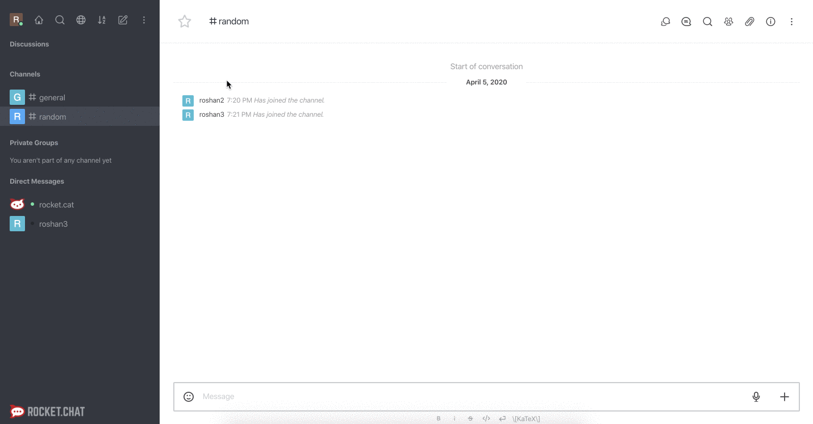
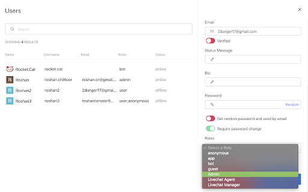
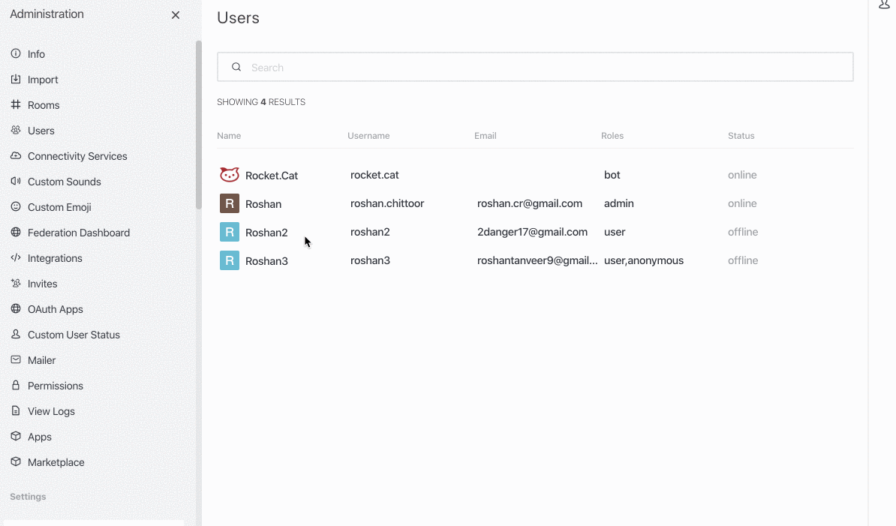

# Manage Users in Rocket.Chat

After installing Rocket.Chat server, Administrators can manage users in the server. This article explains how as an administrator you can create a user, change the user’s role, reset a user’s password, disable/enable users, and remove users from the server permanently. 

## Intended Audience

* Rocket.Chat Administrators 

## Prerequisites 

* Only Administrators can perform actions like add, edit, disable/enable, and delete. If you are a Secondary Admin, ensure to check with the primary administrator before performing these actions. 

## Create a User 

You can create a user by sending an invitation link from your Rocket.Chat server. Once the users sign-up using the invite link they will be visible in your messaging server. Once the users are present in your server, you can Delete, Deactivate, Make as a Secondary Admin, and perform other activities as well. 

To create a user in Rocket.Chat server: 
1. Select a channel. 
2. Click the **Members** icon. The Invite Users pane appears. 

3. Copy the Invite Link using the **Copy to Clipboard** icon. 
4. Send the invite link to users whom you want to invite to your Rocket.Chat server. You can send the invite using email, or any other sharing options. 
5. Once the users sign-up using the invite link, you can see the users in your Rocket.Chat platform default channels. 

## Change a User’s Role or Make someone a fellow Admin
From the Administrator menu, you can make a user as a Secondary Administrator. In the primary administrator’s unavailability, the secondary administrator will be able to add/edit users, disable/enable them. 
1. In **Administration > Users**, select a user. 
2. From the Ellipsis menu, select **Make an Admin**. The selected user will be made admin. 

3. You can also do this procedure from the **Edit** menu > **Role** drop-down. Select Admin from the drop-down to make the user an admin. 

## Reset a User’s Password 
In case a user has forgotten their password, as an administrator you can reset their password from the Administrator menu.

1. In **Administration > Users**, select a user. 
2. Click **Edit**. 
3. At the password section, toggle the **Set random password and send by email option**. The option must turn Green once you toggle it. 
  
  
4. Click **Save**. The selected user will get an email with a temporary password. Users can log in with their temporary password and then can change their password on the server. 
  

## Disable a User 
As an Administrator, you can disable users in your Rocket.Chat server. 
1. In **Administration > Users**, select a user. 
2. Select **Deactivate**. The selected user will be disabled in the Rocket.Chat server. 

## Enable a User
Once you have disabled/deactivated a user from the Rocket.Chat server, you can enable them. 

1. In **Administration > Users**, select a user. 
2. Select **Activate**. The selected user will be enabled in the Rocket.Chat server. 

## Remove Users 
As an Administrator, you can remove users completely from your Rocket.Chat server. 
**Note**: _Removing a user will also remove all the messages related to that user._

1. In **Administration > Users**, select a user. 
2. Select **Delete**. A confirmation message appears asking if you are sure to delete the user.
3. Click **Yes, Delete it!**. The selected user will be deleted along with the user’s messages in the Rocket.Chat server. 

