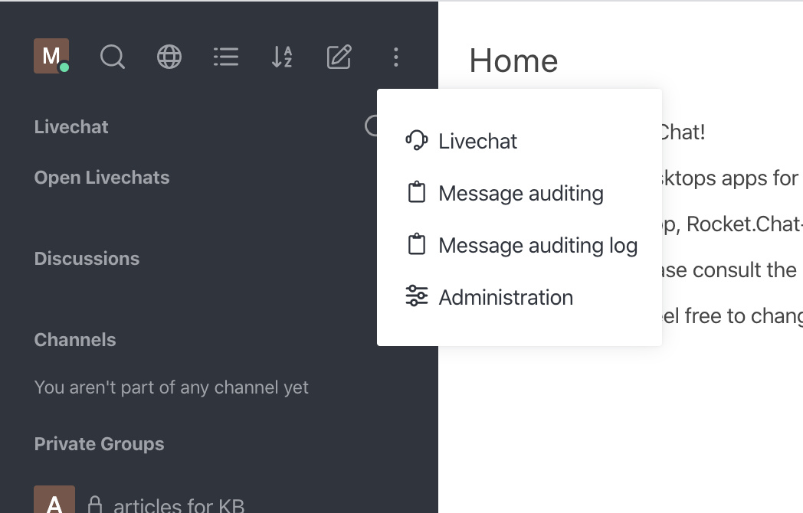

# Message Auditing

Message auditing is only available for Enterprise and Gold versions of Rocket.Chat.

Message auditing in Rocket.Chat provides two exclusive features:

* **Message Auditing Panel**: allows you to assign specific roles to users, who can audit the conversations between any given users within any time range.
* **Message Auditing Log**: allows specific users to check the details about who used the Message Auditing Panel and the actual auditing results.

Both the Message Auditing Panel and the Message Auditing Log are available in the Administration UI.

Use the **Permissions** screen to grant access to `can-audit` and `can-audit-log` for a specific role, Admin role for instance. Roles available include `auditor` and `auditor-log`, which you can assign to people who should be able to perform and verify message inspection, respectively.

## Message Auditing Panel

From the Administration UI, click **Message Auditing** to open the panel. Use the **Message** field to search for a specific message.

You can look through all messages within a specified period of time, in public channels, private rooms and direct messages. The panel allows you to specify the details of your search by **Direct Messages** or **Others**.

### Direct Messages

If you choose to check through Direct Messages, all you need is to:

* Fill in the information about sender and receiver (mandatory)
* Fill in the time range (mandatory)
* Click **Apply**

If you choose to check through Others, the panel requires you to:
* Fill in a room name (mandatory)
* Fill in the time range (mandatory)
* Click **Apply**

### Results

The Message Auditing Panels returns all messages that match the search values defined in the fields. Therefore, all fields are mandatory and must specify time range, sender, receiver, or room name.

The auditor does not have to be a participant in the room to be able to read the messages. However, the auditor cannot read encrypted messages of other users if they are not included in the conversation.

## Message Auditing Log

You must have the `auditor-log` role or the `can-audit-log` permission to use the Message Auditing Log and check the details about who used the Message Auditing Panel with the auditing results returned. 

