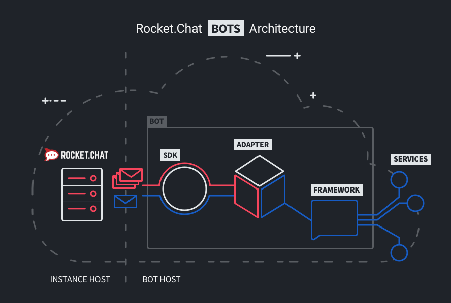

# Bots Architecture

{:style="width='100%' height='auto'"}

The above diagram illustrates the relationship between a Rocket.Chat server
and a chatbot framework or platform. Not all bot frameworks operate the same
way, but the general concepts apply. See below for more detailed definitions.

This would apply to **external** bots. For a definition of external vs internal
bots, see the [Bots FAQ](../bots-faq).

## Users and Bots

Bots in Rocket.Chat require a user account, with the `bot` role. Other than
having certain specific permissions, they are mostly treated just like regular
users within the Rocket.Chat instance. Users with a bot role will also have a
"Bot" tag displayed, so they can't play tricks on us humans.

## Bot Admin

Admins (and only admins) can create and configure the bot account and role
permissions. They set which user fields the bots have access to for privacy
and security and the credentials a bot uses to connect. We're working on better
management views for bots and the future potential of user-activated bots.

## Hosting Bots

External bots are either hosted by the chatbot platform or a custom host set up
by their creator (e.g. using Heroku, Glitch or Docker). Node.js is a popular
language in the space, so we provide utilities catered for Node development, but
not all bots run on Node.js.

## Message Streams

Every user in Rocket.Chat has a collection for their messages that can be
emitted by the server's streamer. Bots subscribe to the collection of messages
for their own user account, creating a stream that is updated every time a
message is sent either directly to them or any room they are joined in.

## Rocket.Chat JS SDK

The SDK is a Node.js module that provides an interface for external applications
to subscribe to message streams, send messages and call methods on the
Rocket.Chat server (via WebSockets / DDP). It would be a dependency of most bots
built on Node.js and we're working on a Python translation as well.

## Framework Adapters

Adapters, sometimes referred to as **connectors** or **middleware**, provide the
parsing of message schemas and methods between the chatbot framework and the
Rocket.Chat SDK. Once loaded into a project, they allow bot creators to compose
interactions in the framework's terms, ignoring the specific requirements of
Rocket.Chat.

## Bot Frameworks

Bot frameworks such as Hubot, Botkit, Rasa and Botpress each provide unique
approaches to composing conversational interfaces. Some run their own hosting
for bots, some just provide the code for you to run yourself. Due to the magic
of adapters, our architecture is mostly independent to your choice of framework.

## External Services

Bots often call external services to provide data or conversational processing.
This is conducted from scripts implementing the bot's framework utilities,
whether it's the bot's own platform provider or NLP service, or some other API,
like a weather service or your own business logic provider.