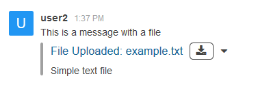

# Rooms Upload

Post a message with attached file to a dedicated room.

| URL | Requires Auth | HTTP Method |
| :--- | :--- | :--- |
| `/api/v1/rooms.upload/:rid` | `yes` | `POST` |

## Payload

| Argument | Example | Required | Description |
| :--- | :--- | :--- | :--- |
| `:rid` | `GENERAL` | Required | Room ID where to post a message |
| `file` | `$HOME/example.txt` | Required | A file name to upload |
| `msg` | `This is a message with a file` | Optional | A message text |
| `description` | `Simple text file` | Optional | A description of the file |

## Example Call

```bash
curl "http://localhost:3000/api/v1/rooms.upload/GENERAL" \
    -F file=@$HOME/example.txt \
    -F "msg=This is a message with a file" \
    -F "description=Simple text file" \
    -H "X-Auth-Token: ijFlJ1yfidXhwEYY284Anoq_iEsOeMMVCupzNhX22tB" \
    -H "X-User-Id: hw5DThnhQmxDWnavu"
```

## Example Result

```json
{
   "success": true
}
```



## Example HTTP dump

```
POST /api/v1/rooms.upload/GENERAL HTTP/1.1
Host: 192.168.2.71:3000
User-Agent: curl/7.45.0
Accept: */*
X-Auth-Token: ijFlJ1yfidXhwEYY284Anoq_iEsOeMMVCupzNhX22tB
X-User-Id: hw5DThnhQmxDWnavu
Content-Length: 457
Expect: 100-continue
Content-Type: multipart/form-data; boundary=------------------------f2ee26fd9d793455

--------------------------f2ee26fd9d793455
Content-Disposition: form-data; name="file"; filename="example.txt"
Content-Type: text/plain

This text file contains a text.
--------------------------f2ee26fd9d793455
Content-Disposition: form-data; name="msg"

This is a message with a file
--------------------------f2ee26fd9d793455
Content-Disposition: form-data; name="description"

Simple text file
--------------------------f2ee26fd9d793455--

HTTP/1.1 200 OK
Access-Control-Allow-Origin: *
X-Instance-ID: 6vZ3BLNJ8jnPZfYYx
Cache-Control: no-store
Pragma: no-cache
content-type: application/json
Vary: Accept-Encoding
Date: Sun, 28 Jan 2018 11:08:18 GMT
Connection: keep-alive
Transfer-Encoding: chunked

{"success":true}
```

## Change Log

| Version | Description |
| :--- | :--- |
| 0.62.0 | Added |
