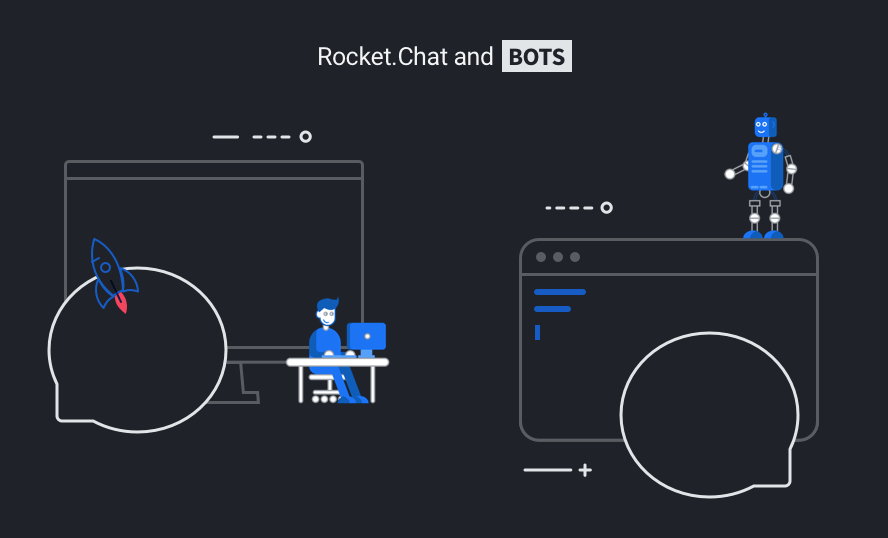

# Using Bots

{:style="width='100%' height='auto'"}

Rocket.Chat supports multiple chatbot and messaging automation integrations,
enabling chat-ops workflows with multi-channel, multi-user, public and private
interactions.

Some Rocket.Chat server packages implement **internal** bots, such as the
[SlackBridge](../../administrator-guides/import/slack/slackbridge/). That type
of integration is not documented here. See the [Bots FAQ](bots-FAQ/) for more on
that distinction.

To contribute to features under development see our
[Bots Project issues](https://github.com/RocketChat/Rocket.Chat/projects/16).

## Getting Started

These are the basic steps to configuring a bot to work with Rocket.Chat.

1. A bot user must be [created by an admin](creating-bot-users/) on the server
2. The bot is run as [a separate process](bots-architecture/) using your chosen framework or platform
    - Most bots require an adapter, which would use the [Rocket.Chat.js.SDK](https://github.com/RocketChat/Rocket.Chat.js.SDK)
    - Currently Rocket.Chat supports an [adapter](https://github.com/RocketChat/hubot-rocketchat) for [GitHub's Hubot Framework](https://hubot.github.com/)
    - We have adapters under development for [Botkit](https://botkit.ai/), [Rasa](https://rasa.com/) and [Botpress](https://botpress.io/)
3. The bot environment must be pre-configured by [setting environment variables](configure-bot-environment/)
4. You provide scripts to define the bot's behaviour according to the requirements of your framework
    - e.g. See [Running a Hubot bot](running-a-hubot-bot/)

## Quick Links

- [Bots FAQ](bots-FAQ/)
- [Bots Architecture](bots-architecture/)
- [Creating Bot Users](creating-bot-users/)
- [Configuring the Bot Environment](configure-bot-environment/)
- [Running a Hubot Bot](running-a-hubot-bot/)

## References

Configuration and implementation details for components of the
[Bots Architecture](bots-architecture/) can be found in their project READMEs:

- [Rocket.Chat JS SDK](https://github.com/RocketChat/Rocket.Chat.js.SDK/)
- [Hubot Rocket.Chat boilerplate](https://github.com/RocketChat/hubot-rocketchat-boilerplate/)
- [Hubot Rocket.Chat adapter](https://github.com/RocketChat/hubot-rocketchat/tree/develop/)
- [Hubot](https://github.com/hubotio/hubot)