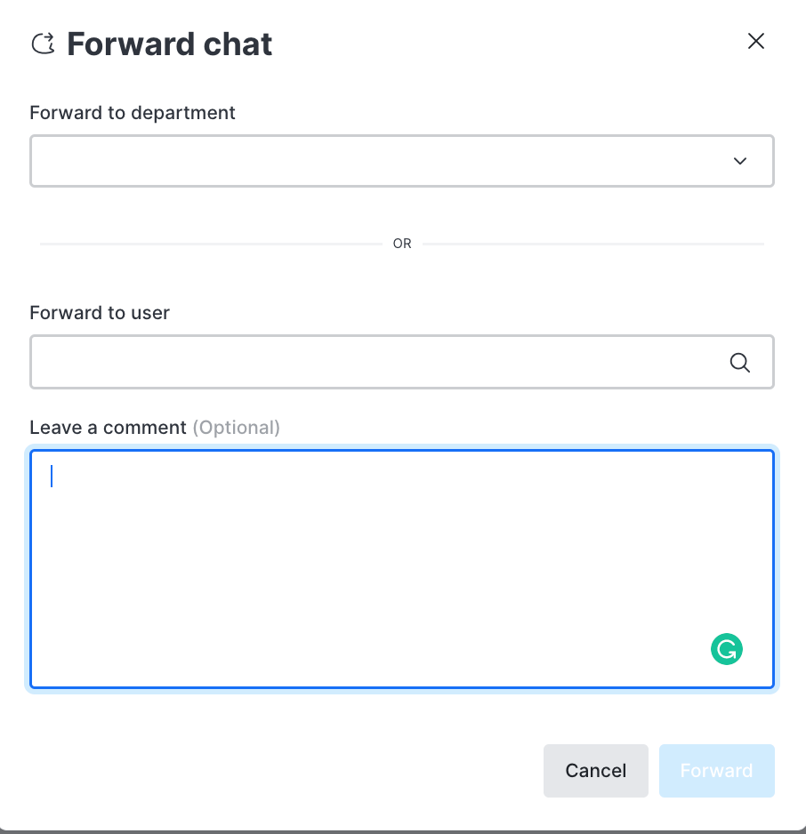

# Rocket.Chat Marketplace

[Rocket.Chat](http://rocket.chat) Apps are extensions, or plugins, that can be added to your workspace to customize your collaboration experience. For example, you can install Reminders and insert the Add Reminder button on a message in your workspace. Rocket.Chat provides many apps that can be installed and managed through the marketplace. You can search for any app on the marketplace and install it on your Rocket.Chat server. You can also upload your custom app package yourself and then install it.

**These Apps can do the following :**

* Display interactive and dynamic content on their own surface - like a modal or the room’s contextual bar.
* Create buttons in the UI for users to interact with native content.
* Create slash commands for users to trigger more generic interactions.
* Register endpoints to receive data from other applications and services.
* Work on both desktop and mobile clients.
* Send messages to users; create and manage public channels, groups, discussions, and threads.


You must register your workspace (even if it is a community edition) on [Rocket.Chat Cloud](https://cloud.rocket.chat) before you can install apps from the Rocket.Chat marketplace.


You can browse Rocket.Chat apps either on our [marketplace](https://rocket.chat/marketplace) or access them directly from **Administration > Apps > Marketplace.**

On the **Explore** tab of the **Apps** screen,

* You can see all the apps available on Rocket.Chat and seach for the one you need.
* You can also filter based on **Categories, Status, and Price.** Choose between multiple categories within the filter to help you find the best app for your workspace users.
*  tag next to an app on the marketplace means you need to upgrade your workspace to a higher version to use the app.

On the **Installed** tab of the **Apps** screen,

* You can find the apps you have installed on your workspace.
* **Enable/Disable/Uninstall** any of your installed apps.
* View App details.
* View **logs** of the app.
* Provide additional user settings and configuration for the app. (All Rocket.Chat Apps might not require any setup configuration or user settings.)

## Types of Apps

### Public Apps

Public Apps are all the apps available on the Rocket.Chat [marketplace](https://www.rocket.chat/marketplace). If you are a third-party publisher/developer, you can also submit an app to the marketplace and Rocket.Chat can approve or reject it.&#x20;

To submit an app to the marketplace, the publisher must have a Rocket.Chat [Cloud Account](https://cloud.rocket.chat/login) and register their publisher account. You can find more about it on our [developer documentation. ](https://developer.rocket.chat/apps-engine/app-submission-to-the-marketplace)


You can learn how to install and enable each of them in the [App Guide](rocket.chat-public-apps-guides/).


### Private Apps

A workspace can develop its apps and publish them on the workspace. These are called private apps. They can only work on the workspace that uploaded it.

If you want to develope your private Rocket.Chat app you can follow the [developer guides here](https://developer.rocket.chat/apps-engine/rocket.chat-apps-engine). If you are looking for the information of user roles in marketplace, check [marketplace-roles.md](../../setup-and-administer-rocket.chat/roles-in-rocket.chat/marketplace-roles.md "mention").

## App Limitations

### Community Edition

For community edition (CE), workspaces can install numerous Public apps (apps from the marketplace) but enable only five. And they can enable three Private apps. Once it reaches the limit, you can upgrade to the enterprise edition (EE) for access to enable all apps in the workspace.  Refer to the table below for better understanding.

| Community Edition 6.0 | Public apps | Private apps |
| --------------------- | ----------- | ------------ |
| Install               | Unlimited   | Unlimited    |
| Enable/Use            | 5           | 3            |

If your workspace version is `5.4` or lower, you can use all the enabled public and private apps you already have. However, you can not purchase or enable more apps once the limit is reached.&#x20;

### Enterprise Edition

For enterprise edition (EE), workspaces can install all Public and Private apps. But, if an enterprise edition (EE) workspace license expires and the workspace has exceded the the **** limit, then marketplace disables all downloaded apps, and the app count returns to zero.

## Enterprise Edition App Offerings

Some apps are part of the **Enterprise Edition** offerings. You don't have to purchase them if you already subscribe to the Enterprise Edition of Rocket.Chat. They include the following:

|                                                                                              |                                                                                      |                                                                                                     |                                                                                                                 |
| -------------------------------------------------------------------------------------------- | ------------------------------------------------------------------------------------ | --------------------------------------------------------------------------------------------------- | --------------------------------------------------------------------------------------------------------------- |
| [Jira Server](rocket.chat-public-apps-guides/atlassian/jira-server-integration.md)           | Jira Cloud                                                                           | [Confluence Server](rocket.chat-public-apps-guides/atlassian/confluence-server-integration.md)      | Confluence Cloud                                                                                                |
| [Bitbucket Server](rocket.chat-public-apps-guides/atlassian/bitbucket-server-integration.md) | Bitbucket Cloud                                                                      | [Bamboo](rocket.chat-public-apps-guides/atlassian/bamboo-integration.md)                            | [Zoom](rocket.chat-public-apps-guides/zoom.md)                                                                  |
| [Data Loss Prevention (DLP)](rocket.chat-public-apps-guides/data-loss-prevention-dlp-app.md) | [Facebook](https://docs.rocket.chat/guides/app-guides/omnichannel-apps/facebook-app) | [Trello](https://docs.rocket.chat/guides/app-guides/trello)                                         | [Instagram Direct](rocket.chat-public-apps-guides/omnichannel-apps/instagram-direct/)                           |
| [Telegram](rocket.chat-public-apps-guides/omnichannel-apps/telegram-app/)                    | [Twitter](rocket.chat-public-apps-guides/omnichannel-apps/twitter-app/)              | [Pexip](../../use-rocket.chat/rocket.chat-conference-call/conference-call-admin-guide/pexip-app.md) | [Google Meet](../../use-rocket.chat/rocket.chat-conference-call/conference-call-admin-guide/google-meet-app.md) |


If you are subscribed to Rocket.Chat's **Enterprise Edition**, you can install and enable any number of paid and free apps available in the marketplace on your workspace.


If you are looking for the manual/user guide of a particular app, check [rocket.chat-public-apps-guides](rocket.chat-public-apps-guides/ "mention") or search for it within the documentation.
