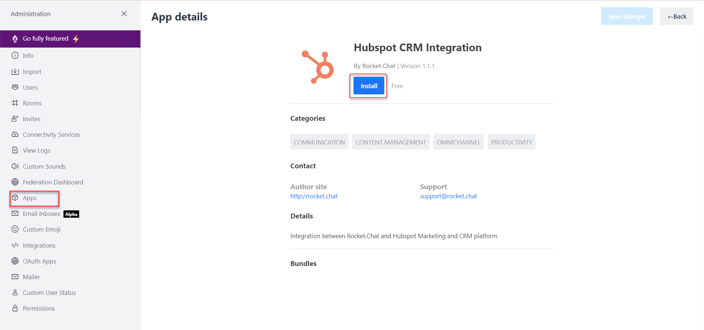

# HubSpot Installation

**To install HubSpot CRM:**

* Go to Rocket.Chat **Administration** > **Workspace** > **Apps**.
* Search for the **HubSpot** App under the **Marketplace** tab in the **Apps** menu on your Rocket.Chat administration panel and then click **Install**.

You are notified about all the permissions the app would access. Click **Agree**. The app is installed successfully.
