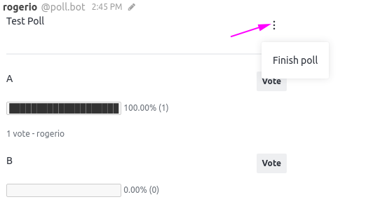

# Poll

Here you will find information on how to install and use the Poll App.

## Installation

You can install our _Poll_ Rocket.Chat App from your Rocket.Chat Administration area.

* Go to **Administration > Marketplace**
* Search for the **Poll** app and click on the item
* Click on the **Install** button

## How to use the Poll App

After the installation, the Poll app will be available by using the slash command _/poll_ in the message box of the channel you want to create the poll

After executing the /poll command, a pop-up will be triggered for the user to create the poll as below:

* Insert your question: Field to add the question related to the poll
* Options field: the options available to reply the poll
* Choice type: you can select if the poll will be multiple choice or single choice
* Add a choice: Here you can add as many options you need for the poll
* Vote type: You can decide if the poll will have "open vote" or "confidential vote"

After creating the poll, the same will be available within the channel/room for the users to vote

In order to finish the poll, select the options menu available in the poll itself and select "Finish poll"

