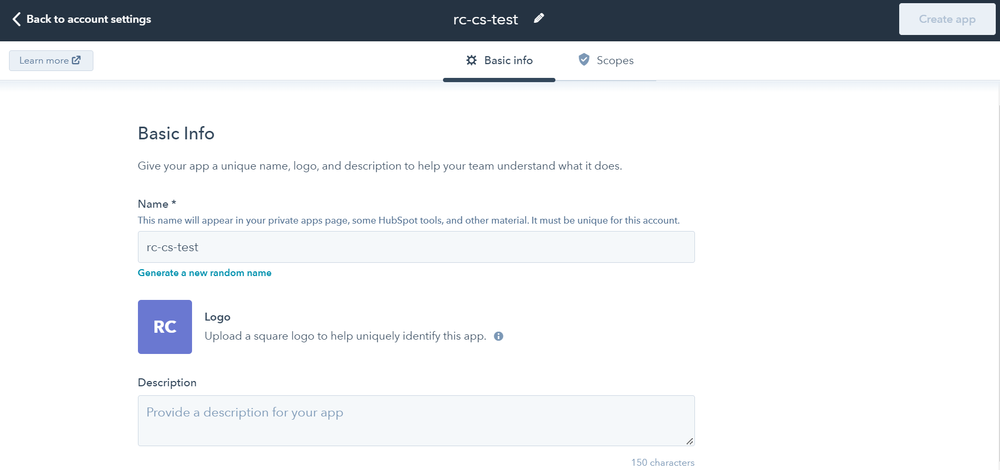
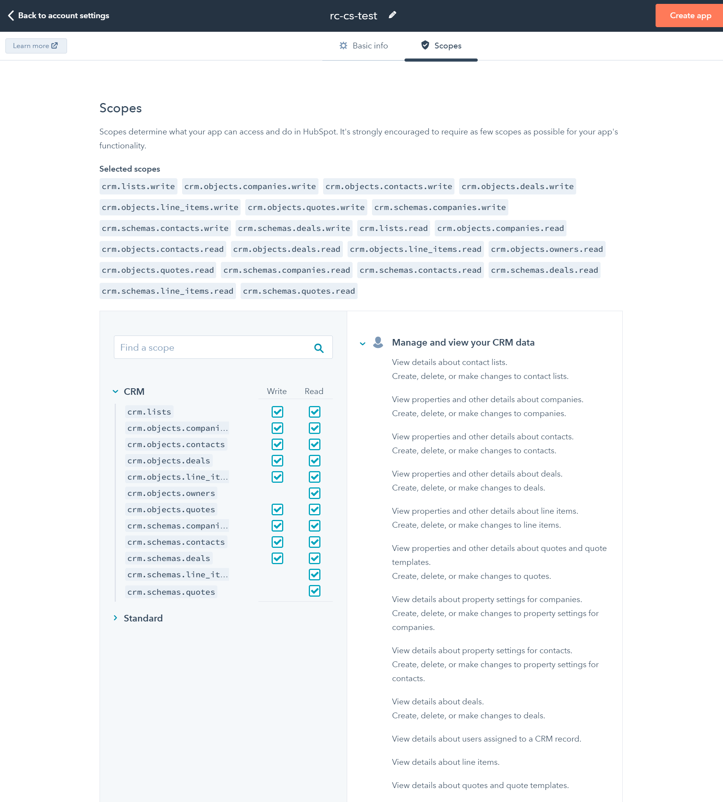

# HubSpot Configuration

Now you need to configure HubSpot CRM integration settings to enable access to HubSpot account information.

.png>)

* Enter the API key or private app's access token to allow access to your HubSpot account information.
* Enable the option to display contact information when assigning the agent to the chat.
* Enable/disable the option to ignore archived objects.&#x20;


**Migrated an API Key integration to a Private app**: Private apps enable you a powerful, secure way to make API calls to your HubSpot account.


Click **Agree**. Your app is installed successfully.

### Create a new private app

This secure method allows you to use HubSpot's APIs to access specific data from your HubSpot account. You can authorize what each private app can request or change in your account, which will generate an access token that is unique to your app.

* In your [**HubSpot**](https://app.hubspot.com/signup-hubspot/developers?hubs\_signup-url=developers.hubspot.com%2Fget-started\&hubs\_signup-cta=developers-getstarted-app\&uuid=5eb23338-41e6-4d2f-8840-9143ae580b22\&step=landing\_page) account, click the **settings** icon **** in the main navigation bar.
* In the left sidebar menu, navigate to **Integrations** > **Private Apps**.
* Click **Create private app**.

* On the _Basic Info_ tab, configure the details of your app:
  * **Name:** Enter your app's name.
  * **Upload icon:** Hover over the placeholder logo and click the upload icon to upload a square image that will serve as the logo for your app.
  * **Description**: Enter a description **** for your app.
* Click the **Scopes** tab.

* Select the **Read** or **Write** checkbox for each scope you want your private app to be able to access. You can also search for a specific scope using the _Find a scope_ search bar.
* After configuring your app, click **Create app** in the top right.
* In the dialog box, review the information about your app's access token, then click **Continue creating**.
* Once you **** have **** created your app, you can start making API calls using the app's access token.
