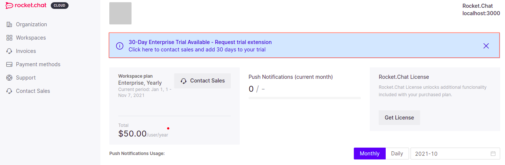

# Enterprise Edition Trial

## Introduction

This procedure explains how to connect your Rocket.Chat instance for the 30 days Enterprise Trial.

Assuming you have your Rocket.Chat server running following any of our guides on [Installing and Updating](../../../../quick-start/installing-and-updating/), the following steps will get you up with linking your workspace to the Cloud Enterprise Edition Trial(CEET).


This tutorial is done with a local instance of the server running on [http://localhost:3000](http://localhost:3000).


## Steps to Setup

### Server Setup

Do the following on your Rocket.Chat server to be able to connect to the CEET.

1. From the **Administration** panel, navigate or search for **Setup Wizard** and accept the **Cloud Service Privacy Terms Agreement** and hit **Save changes**.

.png>)

2\. Head to **Connectivity Services** next and select whether to register Offline or with the Cloud console.

.png>)

Before we continue, let's move on to create a Rocket.Chat cloud account. This will provide us with some vital information we need to proceed.

### Cloud Setup

3\. Goto [https://cloud.rocket.chat/trial/ee ](https://cloud.rocket.chat/trial/ee)and create an account or sign in if you already have one.\
This guide proceeds with creating a new account.

.png>)

4\. You receive an email with a link to create your new workspace with the trial. Click or copy-paste the link in your browser to continue.

.png>)

5\. On the page, you are presented with an interface listing all your workspaces(if you have any).\
To add a new workspace, click the **Register self-managed** button.

 (1) (1).png>)

6\. Next, select whether or not your workspace is connected to the internet or not and hit **Continue**.

### Internet Access/Online

1. If your server has internet access,

.png>)

You're provided with a token. Copy the token and head back to your server's **Administration** panel, where we left off.

.png>)

&#x20; 2\. Select the **Cloud Console** option and proceed with registering a new workspace.

 (1).png>)

3\. You are prompted to enter your Cloud Console Token. Remember the token we copied above? Paste it in the Token field and then click **Connect**.

.png>)

### No Internet Access/Offline

1. To connect to a server without internet access, select the option and **Continue**.

.png>)

&#x20;  2\. You see an interface prompting you to paste the code you copied from your Rocket.Chat self-managed workspace. Let's get the code now.

.png>)

&#x20;  3\. Back on your server, select the Register Offline option.&#x20;

 (1).png>)

&#x20;  4\. A popup appears with the code needed. Copy it and go back to the cloud portal.

.png>)

&#x20;  5\. Paste the code there and click continue.

 (1).png>)

You are then given another code to apply on your server. Copy that code, and go to your **Administration** panel, paste it there, and hit **Finish Registration.**

 (1) (1) (1).png>)

Proceed with following the steps described in [#apply-enterprise-edition-trial](enterprise-edition-trial.md#apply-enterprise-edition-trial "mention") to activate the license on the workspace

7\. When all this is done, refresh the page, and you're able to see your workspace listed with the trial as **Active**.

 (1).png>)

Back on the info section of your **Administration** panel, you should see you're running an **Enterprise License**.

 (1) (1).png>)


We recommend you to sync your server immediately after linking it to the cloud. To do that, head on to the **Connectivity Services** on your **Administration** panel and click on **Sync**.


 (1).png>)

## Apply Enterprise Edition Trial

If you have a Rocket.Chat workspace linked to the cloud already, there is a possibility for you to apply the Enterprise Trial on it, follow this simple procedure to get it done.

### Using Button

1. Go to your [Cloud Portal](https://cloud.rocket.chat/home) **Workspace** where all your connected instances are listed.
2. Sort out the instance you wish to apply the trial on and click on the Apply button at the extreme right.
3. Then click on **Apply Trial** to confirm the action.

.png>)

.png>)

&#x20;  4\. Next, copy the code provided and head over to your workspace **Administration panel** > **Info** and click **Apply Offline License**.

 (1).png>)

&#x20;  5\. Paste the code in the License field provided then **Apply License**

 (2).png>)

## Extending Enterprise Edition Trial

For whatever reason you may need your Enterprise Edition trial to be extended, you can apply for an extension straight from your cloud portal.

Go to your [Cloud Portal](https://cloud.rocket.chat/home) **Workspace** where all your connected instances are listed.

From here, you can apply for an extension following any of the two steps described below.

### Using Banner

1. Click on the instance you want to extend its trial.

 (1).png>)

&#x20;  2\. Then Click on the **banner** showing the availability for trial extension.

&#x20;  3\. Next enter your message or reason why you need the extension then hit **Send Request**. The request will be sent to sales where they will evaluate and respond.

 (1) (1).png>)

### Using UI

1. From your cloud portal workspace, click on the kebab menu by the extreme right on the workspace you want to extend its trial.
2. Then select the **Trial Extension** option on the dropdown that appears.

 (1) (1) (1).png>)

&#x20;  3\. Next enter your message or reason why you need the extension then hit **Send Request**. The request will be sent to sales where they will evaluate and respond.

 (1) (1).png>)
