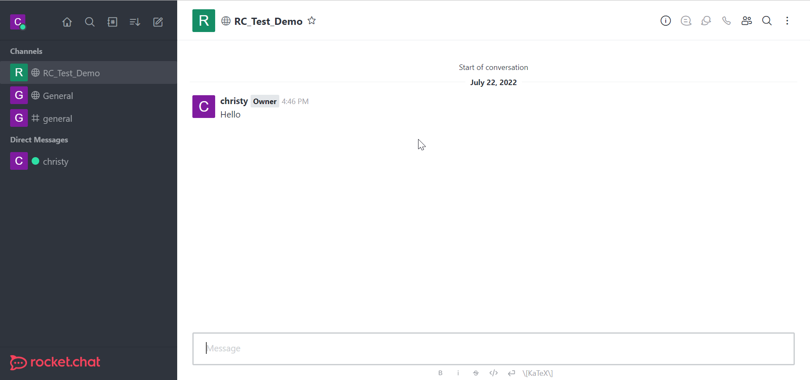

# Matrix Bridge

Rocket.Chat has federation support via the [Matrix](https://matrix.org/) protocol. This new feature ensures quick, secure, and safe ways for different businesses, teams, partners, vendors, or customers to connect and collaborate.

### **Key Features**

In this release, we have introduced the following features:

* Ability to enable or disable Matrix Federation&#x20;
* Rename the slash command from `/bridge` to `/federation` (only able to create DMs at this moment)
* Better UX experience in general
* Ability to create a federated channel from the UI (EE edition)
* Ability to invite external users through the UI (EE edition)
* Ability to create DMs from the UI (EE edition)


You need to set up a homeserver (Synapse).


### Why We Use the Matrix Protocol? 

* To allow Rocket.Chat acts as a Matrix Application Service (Bridge) to Communicate to an appropriate Matrix homeserver (Synapse, Dendrite, etc.)
* To enable the standards-based interoperable federation

## Set up Rocket.Chat with a Matrix Homeserver (Synapse) 

### System Requirements

* 2GB of RAM
* 2CPU
* 20GB of Storage
* For the cloud hosting, choose [Digital Ocean Droplet](https://docs.rocket.chat/quick-start/upgrading-rocket.chat#upgrading-rocket.chat-digital-ocean-oneclick-install)
* [Ubuntu 20.04](https://docs.rocket.chat/quick-start/installing-and-updating/other-deployment-methods/manual-installation/debian-based-distros/ubuntu)

### **Prerequisites**

* Install [Docker](https://docs.docker.com/get-docker/) and [Docker Compose](https://docs.docker.com/compose/install/)
* A Matrix homeserver ([Synapse](https://matrix.org/docs/projects/server/synapse)) that supports application services. You need to have access to register an AppService, which usually involves editing the homeserver configuration file.
* Set up [Traefik](https://traefik.io/)
* Obtain [Lets Encrypt](https://letsencrypt.org/) Certificates
* Configure [nginx](https://docs.rocket.chat/quick-start/installing-and-updating/rapid-deployment-methods/docker-and-docker-compose/docker-containers#5.-installing-nginx-and-ssl-certificate) and setup Nginx Rules
* A domain to host your homeserver on

### Rocket.Chat Matrix Bridge Configuration

Now, you go to **Administration** > **Settings** > **Federation** >**Matrix Bridge**.

The following is a brief explanation of each Matrix Bridge **** configuration option:

* **AppService ID** _(_`Federation_Matrix_id`, _automatically generated by Rocket.Chat)**:**_ A unique identifier for the application service.&#x20;
* **Homeserver Token** _(_`Federation_Matrix_hs_token`, _automatically generated by Rocket.Chat)_**:** A unique homeserver token to authenticate requests to application services. Example: _http://localhost:8008_
* **App Service Token** _(_`Federation_Matrix_as_token`, _automatically generated by Rocket.Chat)_**:** A unique application service token to authenticate requests to homeservers.&#x20;
* **Homeserver URL**(`Federation_Matrix_homeserver_url):`The URL of the Matrix server you want to use as a Proxy homeserver.
* **Homeserver Domain** `(Federation_Matrix_homeserver_domain)`**:** In the homeserver domain, use your federation domain. For example: _local.rocket.chat_
* **Bridge URL**(`Federation_Matrix_bridge_url)`**:** The URL for the Matrix bridge.  IT is the location you want your bridge should run.


* Make sure the port that you are using for the bridge is free in your host, otherwise the Rocket.Chat server will crash trying to run a bridge.
* We recommend a new, empty homeserver, to be used with the federation.
* No user should connect to the homeserver with third-party clients, only Rocket.Chat.


* **AppService User Localpart**(`Federation_Matrix_bridge_localpart`)**:** The local part of the user associated with the application service. The bot user used to execute some actions.
* **Registration** (`Federation_Matrix_registration_file`): **** Automatically generated and updated by Rocket.Chat based on all the values provided in the above settings.
* Click **Save Changes**.&#x20;

You need to have the `Homeserver Token` and the `AppService Token` keys ready.

### Setting up a Matrix Homeserver with Synapse

You can follow the instructions here in the “[https://matrix-org.github.io/synapse/develop/federate.html](https://matrix-org.github.io/synapse/develop/federate.html)” documentation for setting up a federation with synapse.

## Create a federated room

You can [create a channel in Rocket.Chat](https://docs.rocket.chat/guides/user-guides/rooms/channels/create-a-new-channel) and then invite users.

### Invite a federated user

You can invite users from other servers through the slash command.&#x20;

.png>)


If you invite another Rocket.Chat server. It currently will auto-accept.


The structure for the slash command is described below:

/federation invite @username:server\_name

* _/federation -the slash command alias_
* _invite - the command you want to execute_
* _@username:server\_name - This is the typical structure for the invite. You need to use the @username you want to invite, followed by the server\_name split by (:)_


You must run the slash command before, inside the room you want to federate.


### Communicate&#x20;

After you have configured it, you can now send and receive messages within a federated channel.&#x20;

