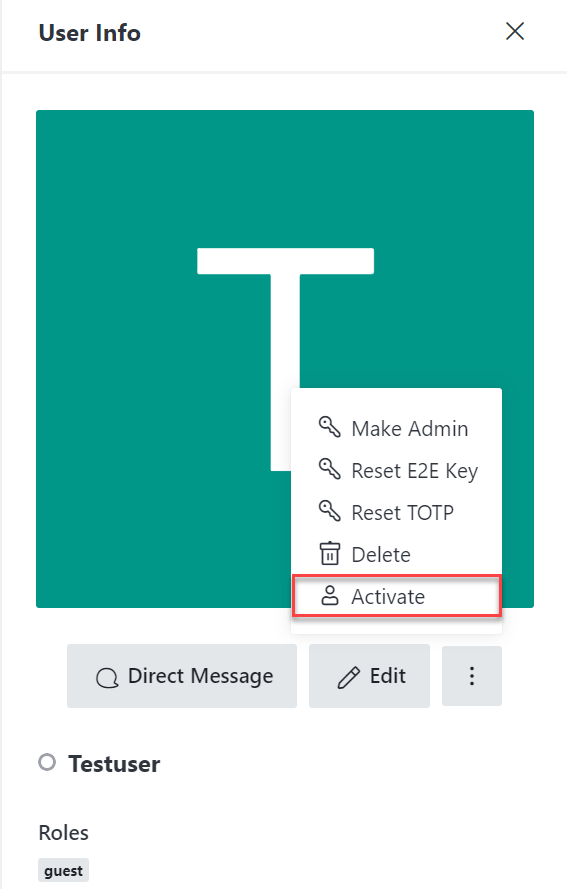
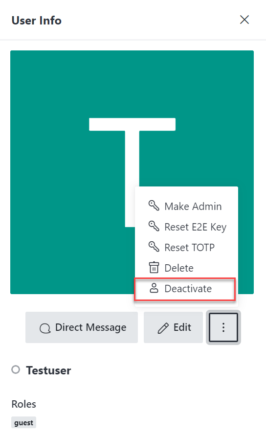

# Manage guest users

* [Guest Users in Rocket.Chat](manage-guest-users.md#guest-users-in-rocket.chat)&#x20;
* [Guest Access Permissions](manage-guest-users.md#rocket.chat-guest-access-permissions)&#x20;
* [Add a guest user](manage-guest-users.md#add-a-guest-user-to-channels)
* [Invite a guest user](manage-guest-users.md#invite-a-guest-user)&#x20;
* [Activate guest users](manage-guest-users.md#enable-guest-users)&#x20;
* [Deactivate guest users](manage-guest-users.md#disable-guest-users)&#x20;

### Before you begin

You should be aware of the limitations set for guest users in Rocket.Chat.

## Guest Users in Rocket.Chat

Guest is a role that is available on Enterprise. All users assigned with the guest role, don't count on the cap of the seat, but they count towards the guest cap. It's possible to set a maximum number of guest users and channels a guest can join for every license.

### What can a guest user do?

As a guest user in Rocket. Chat, you can start the conversation, view direct messages, view joined the room, and view the private room.

#### Guest users cannot:


* create new channels, groups, or DMs;
* create personal access tokens;
* delete own messages;
* mention **all** and **here.**


## **Guest Access Permissions**


Guest is a role that is available on Enterprise, and the permissions are pre-defined for this role.


Go to **Administration > Permissions.** You will notice that the permissions that a guest role has are: start the conversation, view direct messages, view joined the room, and view private room.

#### Permissions Available **for the Guest Role**

### Add a guest user

To add a guest user, go to **Administration > Users > New** as shown below:

Once the guest user is added, you will be able to edit, activate and deactivate the guest role.

### Invite a guest user

To invite a guest user, go to **Administration > Users > Invite** as shown below:

* Type the email address of the guest user that you want to invite to your workspace.
* Click **Add** and then add the guest user, which will then send an invitation to that email address inviting the user to your workspace.

### Activate guest users

* Go to **User Info** and then click **Activate.**

### Deactivate guest users

* Go to **User Info** and then click **Deactivate.**

