# Basic White-labeling

This guide will focus on customizations that non-technical users can make to their Rocket.Chat Server. To achieve this you will be using only the admin settings.

## Layout

Here is where most of the changes to the UI will happen. Found in the administration menu.

### Colors

Let’s start out with the most basic changes you can make to your server, changing colors. Rocket.Chat offers the ability to change most of its elements colors

### Error

The Error variable will change these elements: The background on switch buttons (when disabled)

 (2) (2) (2) (2) (3) (3) (3) (3) (3) (3) (3) (4) (6).png>)

```
The color of the line when you have unread messages (same day or another)
```

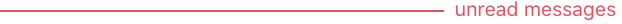 

```
The close button in the audio upload area (inside message box)
```

 (2) (2) (2) (2) (2) (3) (3) (3) (3) (3) (3) (3) (5) (5) (5) (1) (6).png>)

```
The leave/delete button in the room info
```

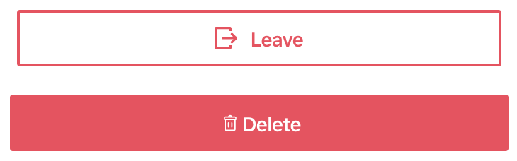

```
The busy status
```


```
Remove button inside the user preferences (Don't ask me again list)
```

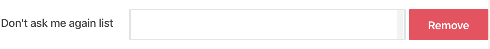

```
Textbox with error on the text verification
```

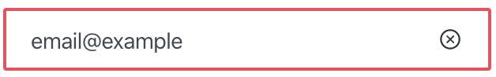

```
Remove user from room button (user info -> more actions)
```

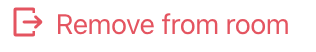

### Error Light

The Error Light variable will change these elements: The border color when disabled

 (2) (2) (2) (2) (3) (3) (3) (3) (3) (3) (3) (4) (8).png>)

```
Icon on the burger menu in mobile-view
```

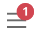

### Alert

The Alert variable will change these elements: Warning icon


```
Away status color
```

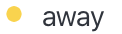

### Alert Light

The Alert Light variable will change these elements: Favorite button color


### Success

The Success variable will change these elements: The online status

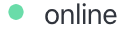

```
The switch button (when enabled)
```

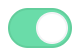

```
The done button in the audio upload area (inside message box)
```

 (2) (2) (2) (2) (2) (3) (3) (3) (3) (3) (3) (3) (5) (5) (5) (1) (8).png>)

### Success Light

The Success light variable will change these elements: Confirmation Icon


### Button Primary

The Button Primary variable will change these elements: The home page links colors

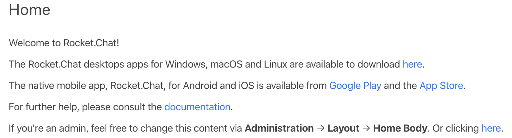

```
The clip icon color in files list
```

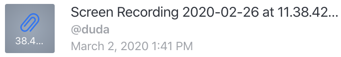

```
Reply in Thread and Reactions button color (message actions / on hover)
```


```
The room actions buttons color (on hover)
```

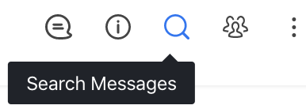

```
The switch button in the room settings
```


```
The reply counter
```

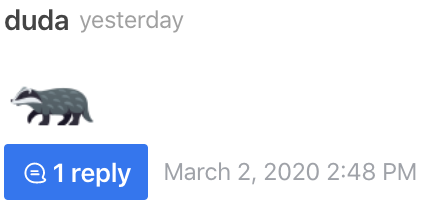

```
Regular expression link in 'Search Messages'
```


```
Record and Ok buttons in Video Message
```

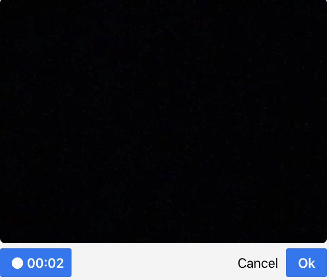

```
Directory active tab
```

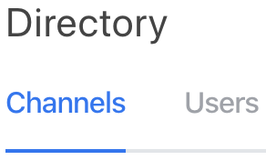

```
Member list actions
```


```
Room info save button
```

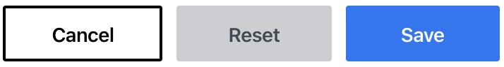

```
Checkbox background (Don't ask me again / modal)
```

 (2) (2) (2) (2) (2) (2) (1) (5).png>)

### Button Primary Light

The Button Primary Light variable will change these elements: Checkbox border (Don't ask me again / modal)

 (2) (2) (2) (2) (2) (2) (1) (8).png>)

### Alert Message Primary

The Alert Message Primary variable will change these elements: The thread icon and the responded message

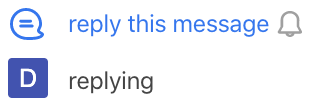

```
Border and font color in mail messages instructions (inside room -> more actions -> mail messages // when you haven't selected any messages)
```

 (2) (2) (2) (2) (2) (4) (4) (4) (1) (9).png>)

### Alert Message Primary Background

The Alert Message Primary Background variable will change these elements: Background color in mail messages instructions

 (2) (2) (2) (2) (2) (4) (4) (4) (1) (10).png>)

### Alert Message Secondary

The Alert Message Secondary variable will change these elements: Border and font color in mail messages instructions

 (2) (2) (2) (2) (1) (9).png>)

### Alert Message Secondary Background

The Alert Message Secondary Background variable will change these elements: Background color in mail message instructions

 (2) (2) (2) (2) (1) (10).png>)

### Alert Message Warning

The Alert Message Warning variable will change these elements: Border and font color in mail messages instructions error

 (2) (2) (2) (2) (4) (1) (9).png>)

```
Border and font color in prune messages warning (room -> more actions -> prune messages)
```

 (2) (2) (2) (2) (4) (4) (3).png>)

### Alert Message Warning Background

The Alert Message Warning Background variable will change these elements: Background color in mail messages instructions error

 (2) (2) (2) (2) (4) (1) (10).png>)

```
Background color in prune messages warning
```

 (2) (2) (2) (2) (4) (4) (7).png>)

### Primary

The Primary variable will change these elements: Sidebar background

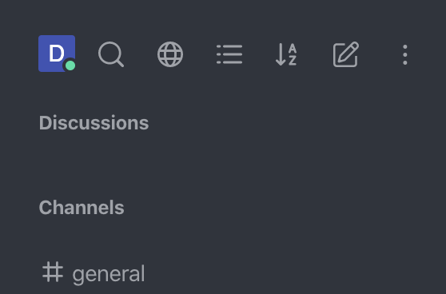

```
Directory channel/user list
```

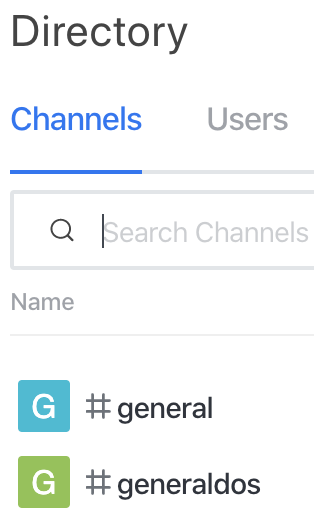

```
Rooms list ADMIN
```


```
Users list ADMIN
```

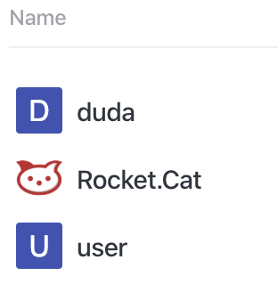

```
Invites list ADMIN
```

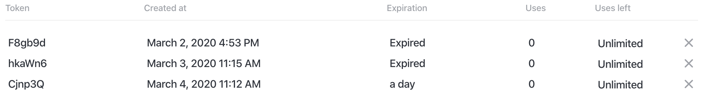

```
Name, details and price of apps on marketplace
```

 (2) (2) (2) (2) (4) (3) (8).png>)

### Primary Darkest

The Primary Darkest variable will change these elements: On hover in rooms and users in the sidebar

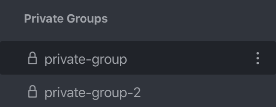

```
Search  on the top of sidebar -> text box background
```


### Primary Dark

The Primary Dark variable will change these elements: The open room

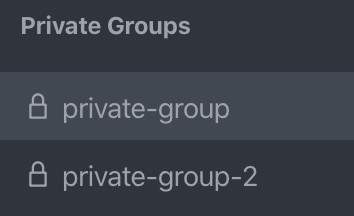

```
The border of text box in search option
```

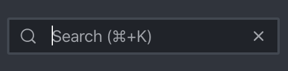

### Primary Light

The Primary Light variable will change these elements: Fonts and icons color/ sidebar

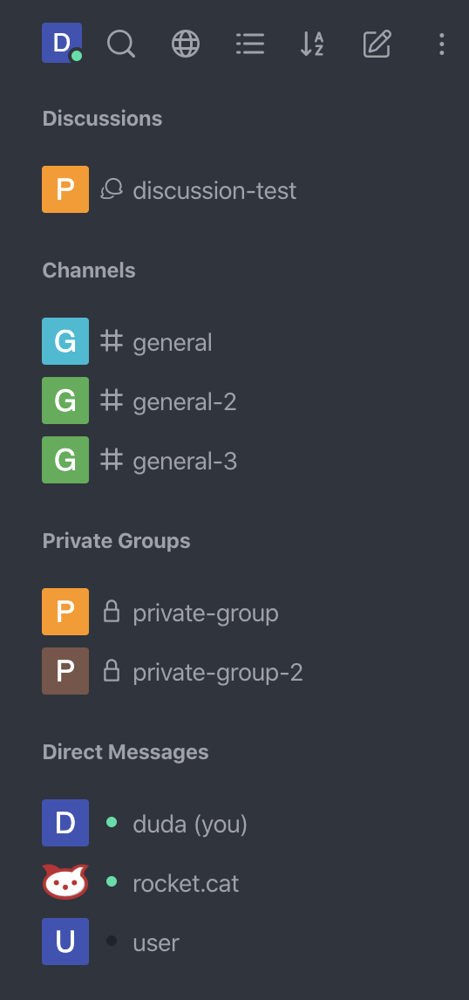

```
Search and rooms font color
```

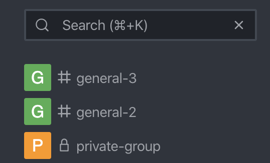

```
Directory/ channels list font color
```

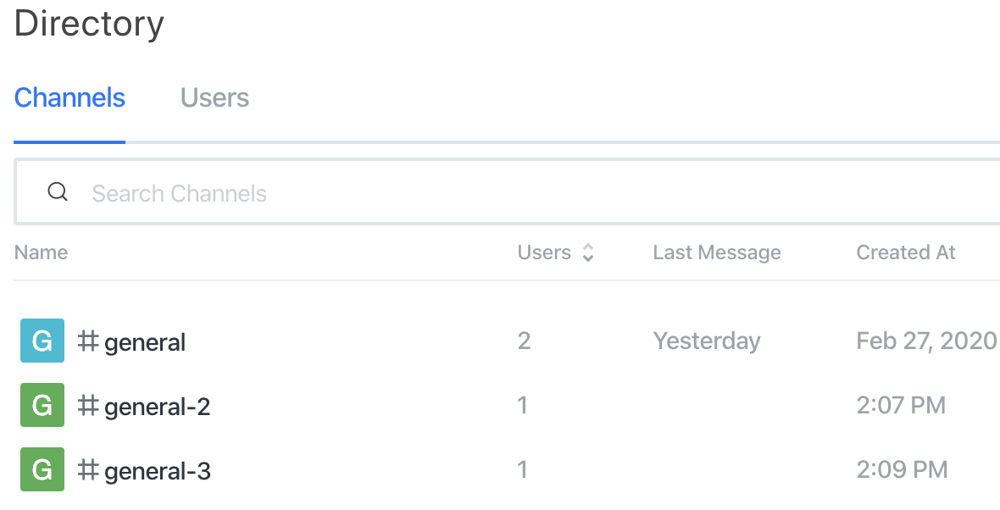

```
Directory/ users list font color
```

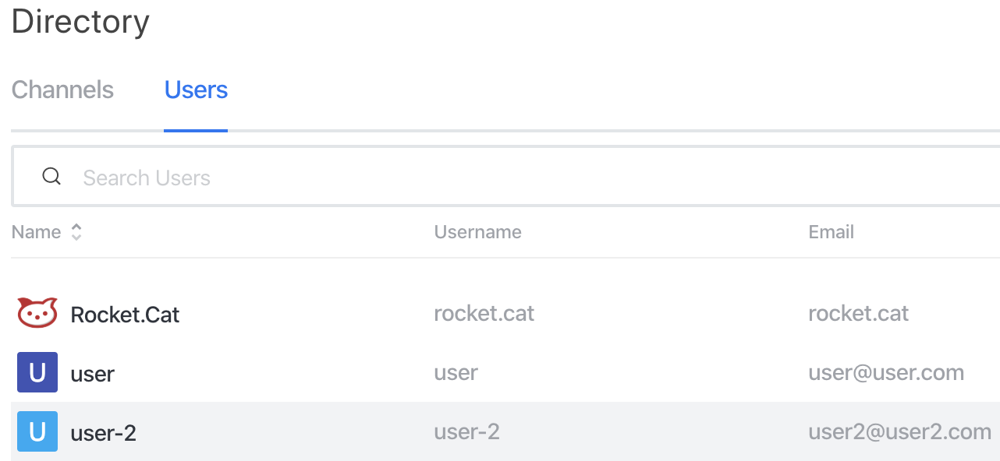

```
Credits on emoji box footer
```

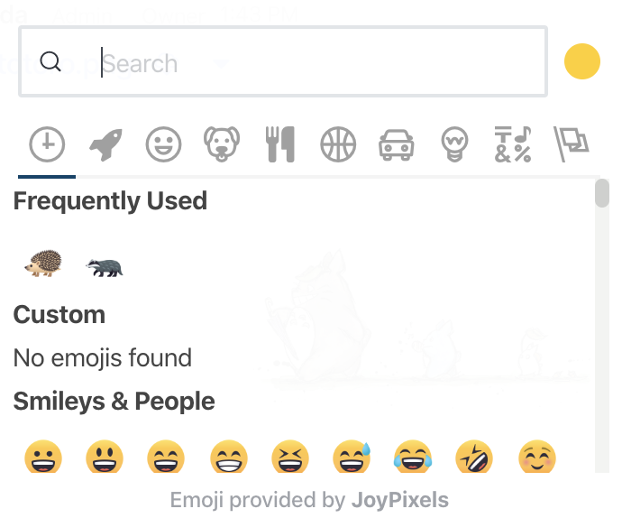

```
Admin tabs on hover
```


```
Settings title on admin
```


```
Font color in marketplace
```

 (2) (2) (2) (2) (4) (3) (6).png>)

### Primary Light Medium

The Primary Light Medium variable will change these elements: Don't ask me again unchecked border of checkbox

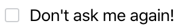

```
Invite users placeholder
```

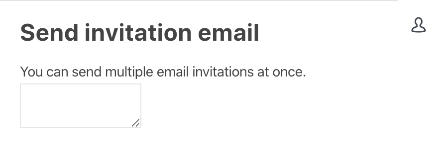

### Primary Lightest

The Primary Lightest variable will change these elements: directory hover on room

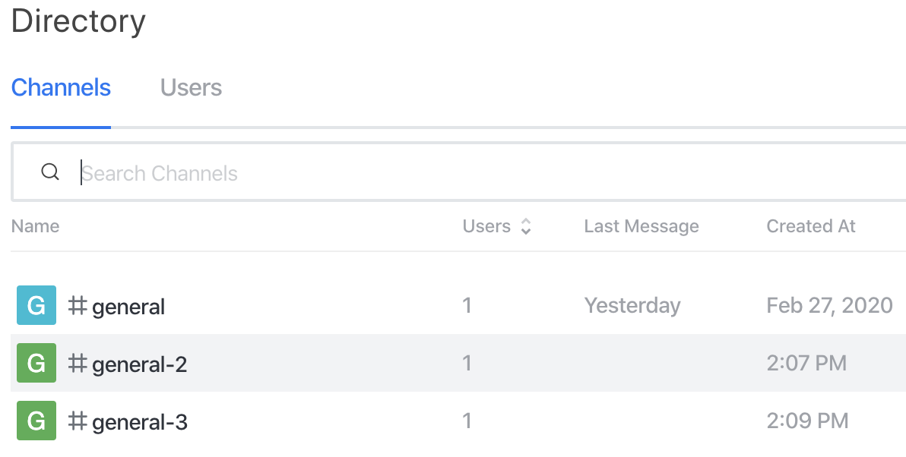

```
directory hover on user
```

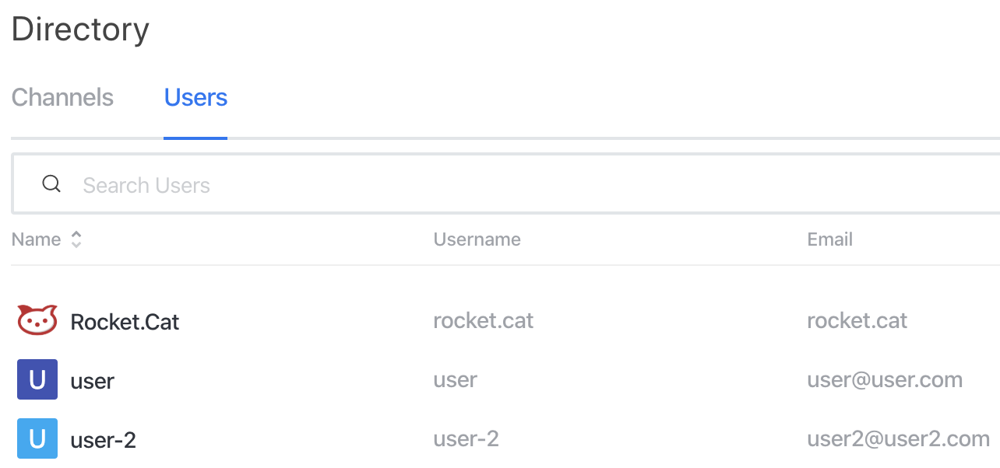

```
admin sidebar background
```

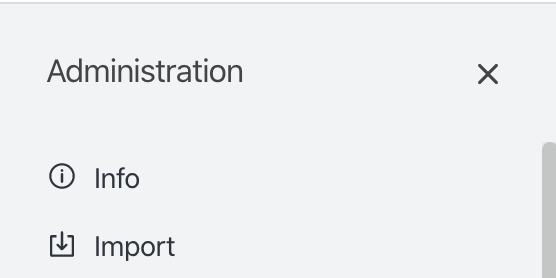

```
admin rooms list on hover
```

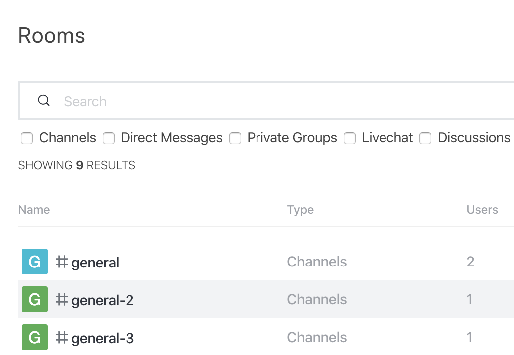

```
admin users list on hover
```


### Content

The Content variable will change these elements: color of the number of unread messages (mobile view)

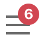

```
color of the name, number and more actions when you have unread messages
```


### Link Active

The Link Active variable will change these elements: the hover and active color on icons / room actions

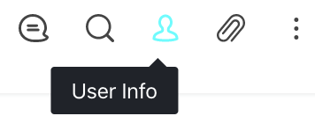

```
the loader when you prune messages
```

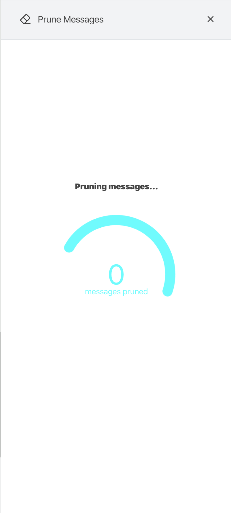

## Content

The content section allows you to change the HTML content of a number of screens on your Rocket.Chat server. The following screens are available to be edited:

* **Home Title:** The title on the header of the first screen that your users will see when they log in.
* **Home Body:** The content of the first screen that your users will see when logging in.
* **Login Terms:** This is the text under the login page.
* **Terms of Service:** By default this screen is accessed on the links under the login page, here you can set the terms of service of your server. Can also be accessed via YOUR-SERVER-URL/terms-of-service
* **Privacy Policy:** By default this screen is accessed on the links under the login page, here you can set the privacy policy of your server. Can also be accessed via YOUR-SERVER-URL/privacy-policy
* **Legal Notice:** By default this screen is accessed on the links under the login page, here you can set the legal notice of your server. Can also be accessed via YOUR-SERVER-URL/legal-notice
* **Side navigation footer:** This is the logo on the left sidebar. We recommend using the images set on your [Assets](basic-white-labeling.md#assets) for better consistency.

### Fonts

Here you can define the font family for the system in a list separated by commas, Rocket.Chat will try to use the available fonts starting from left to right.

### User Interface

* **Display Roles:** Toggles the display of user roles by the usernames on messages
* **Group Channels By Type:** Enabling this will separate the channels by category (Channel, Private Room, DM or discussion) on the left sidebar.
* **Use Full Name Initials to Generate Default Avatar:** This will make so the default avatars are generated using the person Full Name instead of Username. E.g. By default the user `blue.ducks` with the name `Richards Nate` will have an avatar with the letters `BD`, if this setting is active, it will be `RN`.
* **Use Real Name:** Enabling this will change the display of Usernames to Full Names
* **Click to Create Direct Message:** Enabling this will make it so when you click an avatar, it will open a DM with the selected user.

Unread Counter Style:

* **Different Style for user mentions:** This will make the notification counter differentiate normal messages from mentions
* **Same style for mentions:** This will make the counter mark mentions and normal messages as the same
* **Allow Special Characters in Room Names:** This will enable the use of special characters like `! @ # $ % ^ & *` in room names
* **Show top navbar in embedded layout:** This toggles the top navbar when using `?layout=embedded` in the end of the url

## Assets

Here you will be able to change most of the logos on your server. Found in the administration menu.

* logo (svg, png, jpg)
  * Changes the logo on the footer of the left sidebar
  * Changes the logo on the login page
* login background (svg, png, jpg)
  * Changes the background of the login page

The next items are mostly icons for different operational systems and platforms, we recommend using the same image with the specified size and format on each item: Favicons are used in the browser tabs and as the icon for the server on the desktop application:

* favicon (ico)
* favicon (svg)
* favicon 16x16 (png)
* favicon 32x32 (png)

Icons for the notifications on chrome in android:

* android-chrome 192x192 (png)
* android-chrome 512x512 (png)

Icons for favorites on Iphone:

* apple-touch-icon 180x180 (png)
* apple-touch-icon-precomposed 180x180 (png)

Tiles on Microsoft Windows 10 start menu:

* mstile 70x70 (png)
* mstile 144x144 (png)
* mstile 150x150 (png)
* mstile 310x310 (png)
* mstile 310x150 (png)

Safari pinned tab Icon:

* safari pinned tab (svg)
