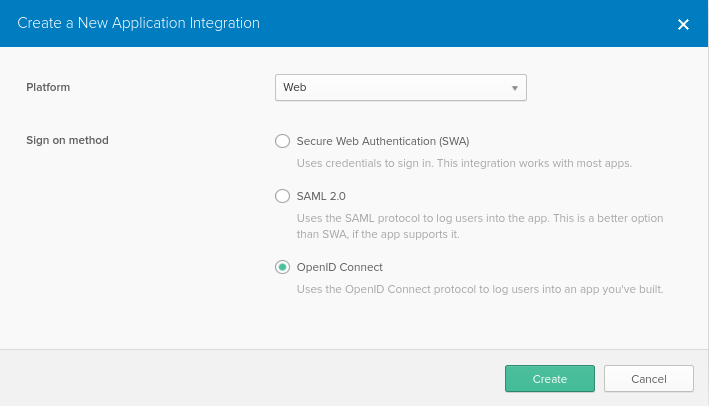

# Okta Identity Cloud Service

Okta Identity Cloud Service can be integrated as an Identity Provider for Rocket.Chat via its Open ID Connect support.

## Rocket.Chat Settings

On the Rocket.Chat OAuth settings page **add a custom auth**.

Give the custom OAuth a unqiue name. For this example we will use _okta_.

Set the following:

* **Enabled**: _True_
* **URL**: The URL to your okta domain on okta.com with a suffix of _/oauth2/v1_. For example: _`https://mycompany.okta.com/oauth2/v1`_
* **Token**: _/token_
* **Token Sent Via**: _Header_
* **Identity Token Sent Via**: _Same as Token Sent Via_
* **Identity Path**: _/userinfo_
* **Authorize Path**: _/authorize_
* **Scope**: _openid email profile groups offline\_access_
* **Param Name for access token**: _access\_token_
* **id**: Set to the **Client ID** in the Okta app **Client Credentials** below.
* **Secret**: Set to the **Client secret** in the Okta app **Client Credentials** below.
* **Login Style**: Either setting works. Popup with pop up the Okta check/login in another window. Redirect will redirect the current page.
* **Button Text**: Set to personal preference.
* **Button Text Color**: Set to personal preference.
* **Button Color**: Set to personal preference.
* **Username field**: _preferred\_username_
* **Avatar field**: Was not used on our Okta instance. Further research will be required to use this.
* **Roles/Groups field name**: roles
* **Merge Roles from SSO**: Our server syncs from ldap so we left this _false_.
* **Merge users**: Our server syncs from ldap so we left this _false_.

## Configuring the Identity Provider

### Adding a new Application in Okta

On your Okta Applications Dashboard, find the button to create a new app. It should open the following pop-up:

Select **OpenID Connect** and select **Create** to open the window to create the new integration.

### Create Integration

!\[Create Integration]\[CreateIntegration]

The only information needed on this page is the **application name** and **redirect URI**. The URI you need to use here is the same one that is shown on the **callback URL** listed at the top of the page after creating the custom OAuth section in the Rocket.Chat settings. In this example the custom oauth will be called _okta_. This will result in a **redirect URI** of _`https://my-rocketchat-server.org/_oauth/okta`_.

Select **Save** to be taken to the **General Settings** for the new app.

### Client Credentials

Copy the **Client ID** to the Rocket.Chat **id** field on the oauth settings page.

Copy the **Client secret** to the Rocket.Chat **secret** field on the oauth settings page.

### Testing

Everything should be properly configured now. You can now assign users or groups users to your Integration app on the Okta Dashboard and then test the login on your Rocket.Chat instance.

\[CreateIntegration]: CreateIntegration.png
