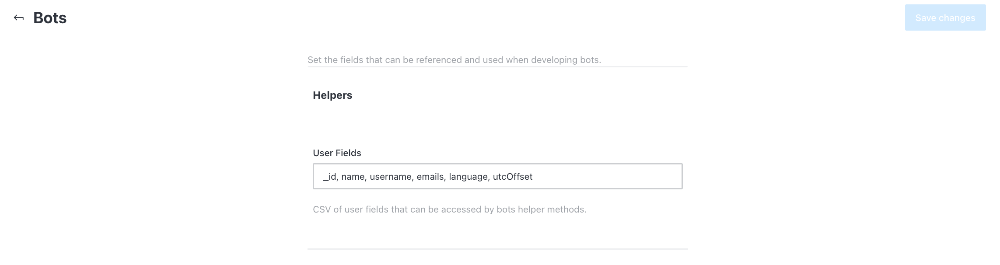

# Bots

Rocket.Chat Bots setting lets you specify the various fields that can be accessed by bots helper methods. These fields can be referenced and used when developing bots.

To access this menu, go to **Administration** > **Settings** > **Bots**.

* **User Fields**: This takes in comma-separated fields that can be accessed by bots helper methods.
