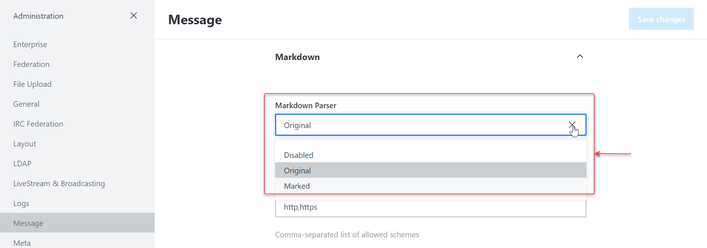

# Message

In this section, you have settings regarding messages on your server and all the actions that can be performed with them.

To access this section, go to **Administration** > **Settings** > **Message**.


Remember to hit **Save Changes** in order to apply any changes made.


* **Allow message Editing**: When enabled, users will have the ability to edit messages.
* **Block message editing after**: takes in time in minutes in which users are allowed to edit messages in which after they'll be unable.
* **Allow message deleting**: When enabled, users will be able to delete messages.
* **Block message deleting after**: Let's you set a duration in minutes in which users are allowed to delete messages.
* **Allow Unrecognized Slash Commands**: When enabled, unknown Slash Commands will be allowed.
* **Allow user direct messages to yourself**: when enabled, users will be able to send direct messages to themselves.
* **Always Search Using RegExp**: When enabled, all searches will use RegExp. We recommend setting `True` if your language is not supported on [MongoDB text search](https://docs.mongodb.org/manual/reference/text-search-languages/#text-search-languages).
* **Show Edited Status**: This will show `edited` whenever a message has been edited.
* **Show Deleted Status**: Shows `deleted` when a message has been deleted.
* **Allow Message bad words filtering**: When enabled, words in the blacklist will be filtered on the server.
* **Add Bad Words to the Blacklist**: Takes in a list of comma-separated words that will be filtered from the server.
* **Remove words from the Blacklist**: Takes in any word already in the Blacklist and removes it.
* **Keep Per Message Editing History**: Whether or not to keep message editing history.
* **Maximum Channel Size for ALL Message**: Lets you set the maximum size of a channel.
* **Maximum Allowed Characters Per Message**: Lets you set the maximum characters a message can contain.
* **Allow converting long messages to attachments**: When enabled, long messages can be converted to attachments.
* **Show Formatting Tips**: when enabled, formatting tips will be shown below the message field.
* **Grouping Period (in seconds)**: Messages will be grouped with the previous message if both are from the same user and the elapsed time was less than the informed time in seconds.
* **Embed Link Previews**: Whether embedded link previews are enabled or not when a user posts a link to a website.
* **Embed Request User Agent**: Lets you set a request user agent.
* **Message\_SetNameToAliasEnabled**: Enable to set message alias.
* **Embed Cache Expiration Days**: Lets you set how long you want the cache to be embedded.
* **Disable Embed for Users**: Comma-separated list of usernames to disable the embedded link previews.
* **Embed Ignored Hosts**: Comma-separated list of hosts or CIDR addresses, eg. `localhost`, `127.0.0.1`, `10.0.0.0/8`, `172.16.0.0/12`, `192.168.0.0/16`
* **Safe Ports**: Comma-separated list of ports allowed for previewing.
* **Time Format**: Let's you set the format of time on your server. See also: [Moment.js](http://momentjs.com/docs/#/displaying/format/)
* **Date Format**: Lets you set the format of the date in your server.
* **Time and Date Format**: Lets you set the time and date format.
* **Maximum Number of Chained Quotes**: Lets you set the maximum number of Chained quotes.
* **Hide System Messages**: Set whether or not system messages will be hidden.
* **DirectMesssage\_maxUsers**: Specifies the maximum uses for direct messages.
* **Message Erasure Type**: Select from the drop-down what to do with messages of users who removed their account.
* **Code highlighting languages list**: Comma separated list of languages (all supported languages at [https://github.com/highlightjs/highlight.js/tree/9.18.5#supported-languages](https://github.com/highlightjs/highlight.js/tree/9.18.5#supported-languages) ) that will be used to highlight code blocks.
* **Video Recorder Enabled**: Requires `video/webm` files to be an accepted media type within **File Upload** settings.
* **Show Read Receipts**: Whether to show read receipt.
* **Detailed Read Receipts**: Shows each user's read receipts.
* **Allow Message Pinning**: When enabled, allow messages to be pinned to any of the channels.
* **Allow Message Snippeting**: when enabled, message sniping will be allowed.
* **Allow Message Starring**: when enabled, users will be able to star messages.

## Message Attachments

* **Group Attachment Buttons**: This groups the icons under an expandable menu. Takes up less screen space.
* **Enable image thumbnails to save bandwidth**: Thumbnails will be served instead of the original image to reduce bandwidth usage. Images at original resolution can be downloaded using the icon next to the attachment's name.
* **Thumbnail's max width (in pixels)**: Lets you set in ox the maximum thumbnail width.
* **Thumbnail's max height (in pixels)**: Lets you set in ox the maximum thumbnail height.
* **Remove EXIF metadata from supported files**: Strip out EXIF metadata from image files (jpeg, tiff, etc). This setting is not retroactive, so files uploaded while disabled will have EXIF data.

## Audio Message

* **Audio Recorder Enabled**: When set to true, users will be able to record audio.
* **Audio Message Bit Rate**: Lets you set the bit rate for audio messages.

## Hex Color Preview

* Enabled: Let's you set preview for hex colors.

## Issue tracker links

* **Enabled**: Lets you enable issue link tracker.


Warning: Do not enable this and the **Hex Color Preview** at the same time.


* **Template for issue links**: Template for issue links; `%s` will be replaced by the issue number.

## **AutoLinker**

* **Enabled**: Lets you enable auto-linking.
* **AutoLinker Strip Prefix**: When enabled, linking will be stripped. Short display. e.g. `https://rocket.chat` => `rocket.chat`
* **AutoLinker Scheme:// URLs**: Scheme auto linker.
* **AutoLinker 'www' URLs**: www URLs will be auto-linked.
* **AutoLinker TLD URLs**: When enabled, TLD URLs will be auto-linked.
* **AutoLinker URL Regular Expression**: Lets you set RegExp for URL auto-linking.
* **AutoLinker Email**: When enabled, emails will be auto-linked.
* **AutoLinker Phone**: Automatically linked for Phone numbers. e.g. `(123)456-7890`

## Auto-Translate

* **Enable Auto-Translate**: Enabling auto-translation will allow people with the `auto-translate` permission to have all messages automatically translated into their selected language. Fees may apply.
* **Service Provider**: A drop-down to select the translation service provider.

### **DeepL**

* **API Key**: Takes in DeepL API key.

### **Google**

* **API Key**: Takes in the Google API key.

### **Microsoft**

* **Ocp-Apim-Subscription-Key**: Takes in your Microsoft Ocp-Apim-Subscription-Key.

## Google Maps

* **Enable Mapview**: Enabling map view will display a location share button on the right of the chat input field.
* **Google Static Maps API Key**: The Google Static Maps API Key. This can be obtained from the Google Developers Console for free.

## **Katex**

* **Katex Enabled**: Allow using [katex](http://khan.github.io/KaTeX/) for math typesetting in messages.
* **Allow Parenthesis Syntax**: When enabled, you can use \[katex block] and (inline katex) syntaxes.
* **Allow Dollar Syntax**: Allow using `$$katex block$$` and `$inline katex$` syntaxes

## **Markdown**

* **Markdown Parser**: A dropdown to select the markdown parser.&#x20;

* **Allow Markdown headers in messages**: When enabled, markdown headers will be included in messages.
* **Markdown Support Schemes for Link**: Comma-separated list of allowed schemes.
* **Enable Marked GFM**: Enable Marked GFM
* **Enable Marked Tables**: Enables marked tables
* **Enable Marked Breaks**: Enables marked breaks
* **Enable Marked Pedantic**: Enables Marked Pedantic
* **Enable Marked Smart Lists**: Enables Marked Smart Lists
* **Enable Marked Smartypants**: Enables Marked Smartypants
