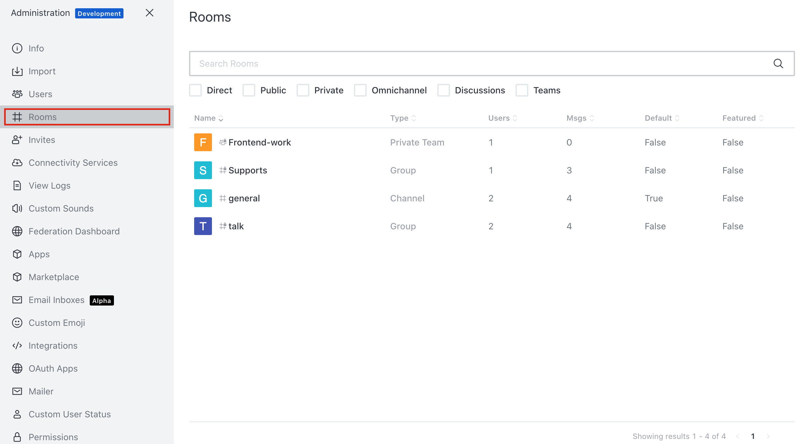
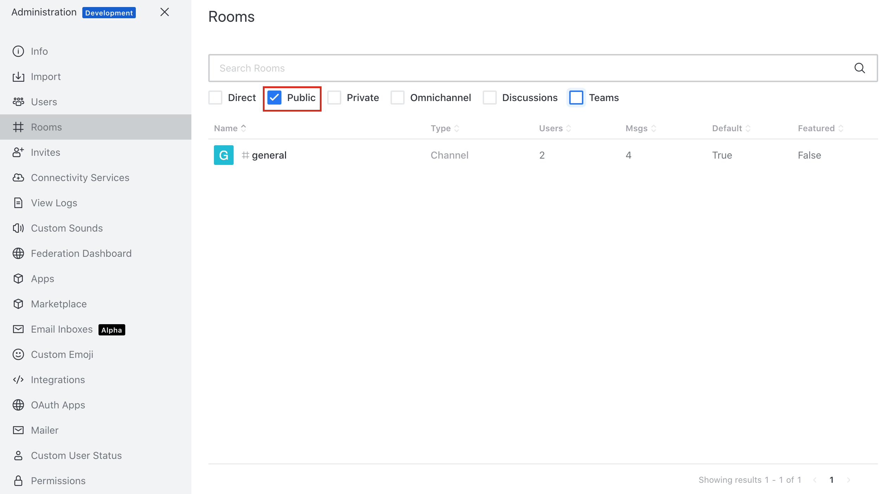
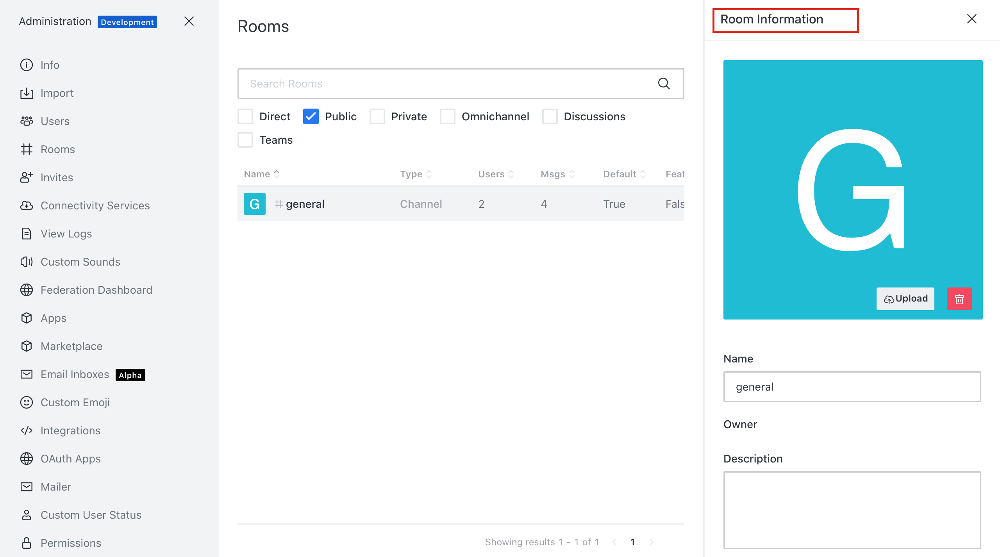
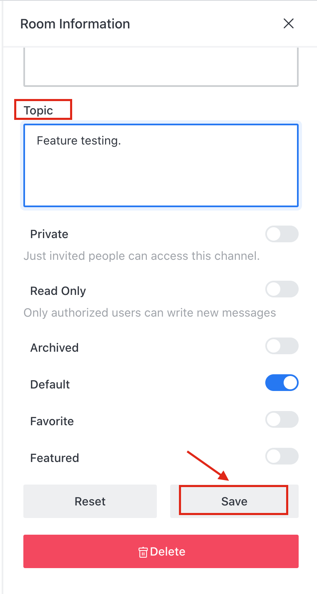
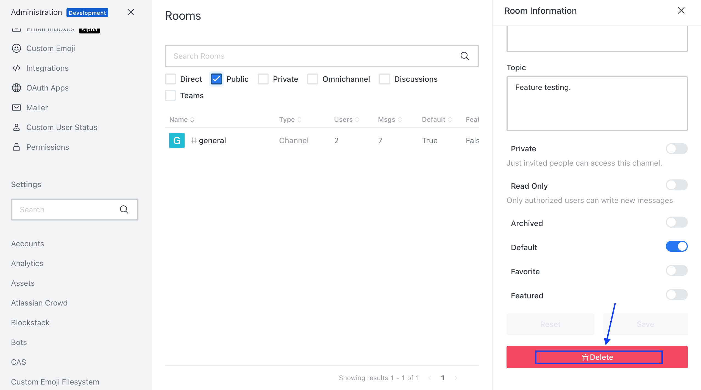
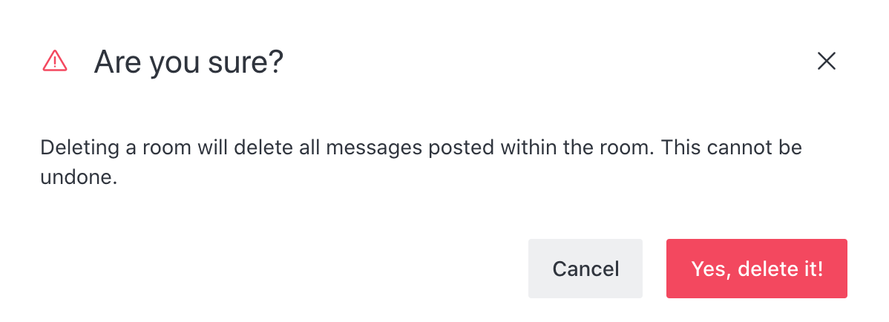

# Rooms

Rocket.Chat allows you to see the room details as well as provides an option to edit room details and an option to delete the room.

## See rooms

* Go to the **Administration** tab.
* Select  **Rooms**.
* Here you can see the all rooms that are currently exist in your Rocket.Chat applications along with details like number of users in a room, number of messages, type of room etc as shown in below image.

* Also has a list of filters like **Public**, **Private** etc available to help users to search for a specific room easily and faster. 

## Edit Room Details

* Click on the room, you want to edit the details.
* Here you have options to change room image, edit room details and also have options to configure other settings with respect to this room like Read Only, Private etc. as shown in below image.

* After doing changes, click on save button.

## Delete Room

* Search and click on the room you want to delete in the `rooms` section under the `Administration` tab.
* Press **Delete** to delete the room respectively.

* Click **yes,delete it!** to delete a room.

