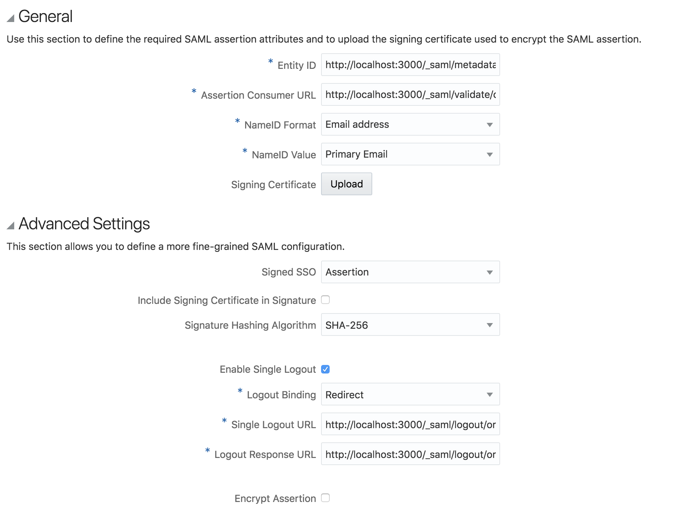
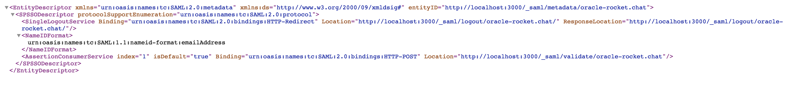

# Oracle Identity Cloud Service

## Configuring the Identity Provider

Oracle Identity Cloud Service is integrated as a SAML Identity Provider. For detailed explanation on the SAML options on Rocket.Chat, check the [SAML Documentation](./).

## Step by Step configuration of Oracle Identity Cloud Service

### Before you begin

Before you create your IDCS application, make sure you have enabled SAML per the [SAML Documentation](../). You will need to have entered a _Custom Provider_ and a _Custom Issuer_ URL on the SAML settings page in Rocket.Chat.

**Note:** Leave the _Custom Entry Point_ and _IDP SLO Redirect URL_ values as the default values for now. We will obtain these URLs below, but you must save the SAML settings with your _Custom Issuer_ URL so you can visit this URL and obtain values that are necessary when creating the IDCS application below.

### Adding a new Application

On your Oracle Cloud Applications Dashboard, find a button to add a new application. It should open the following pop-up:

Select **SAML Application** to open the configuration wizard.

### App Details

The only information needed on this page is the application name and URL. The URL you need to use here is the same one that is set on the _Custom Issuer_ SAML configuration field on the Rocket.Chat settings.

### SSO Configuration

To get the values for those new settings, you need to access the same _Custom Issuer_ URL that you used on the previous page. It should show a XML file similar to the one below:

On the **AssertionConsumerService** tag, you need to copy the value of the _Location_ attribute. Then paste this value on the _Assertion Consumer URL_ field on the Oracle Settings. On the **SingleLogoutService** tag, you need to copy the value of the _Location_ attribute, then paste it in the _Single Logout URL_ param of the Advanced Settings. On the same **SingleLogoutService** tag, you need to copy the value of the _ResponseLocation_ attribute, then paste it in the _Logout Response URL_ param of the Advanced Settings.

Finally, the _Entity Id_ param receices the URL of the XML file itself \(same URL you used as the application URL\).

Before clicking on **Finish**, click the **Download Identity Provider Metadata** button to download another XML file.

### Rocket.Chat Settings

There are two Rocket.Chat settings that need to be copied from the IDP Metadata you just downloaded: _Custom Entry Point_ and _IDP SLO Redirect URL_.

For the first one, locate the tag **md:SingleSignOnService** and copy the value of the _Location_ attribute, \(ends with `/idp/sso`\).

For the second param, locate the tag **md:SingleLogoutService** and copy the value of the _Location_ attribute \(ends with `/idp/slo`\).

There may be multiple occurences of those tags in the XML file, so make sure that the copied URLS end with `/idp/sso` and `/idp/slo` and not `/sp/sso` and `/sp/slo`.

### Testing

Everything should be properly configured now. You can now add users to your SAML Integration app on the Oracle Dashboard and then test the login on your Rocket.Chat instance.

