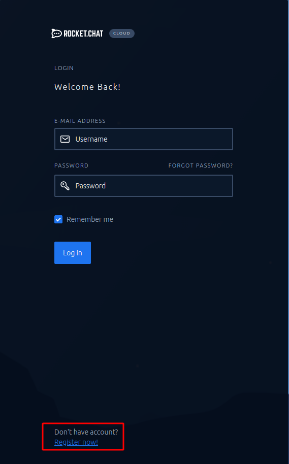
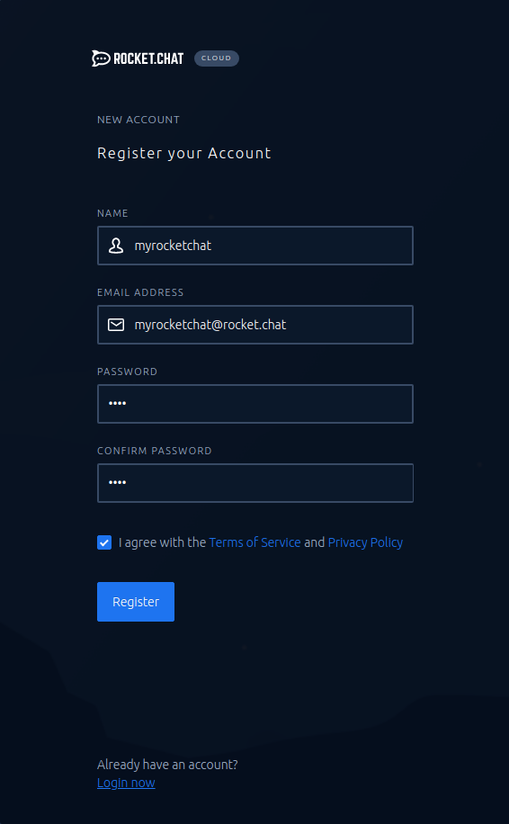
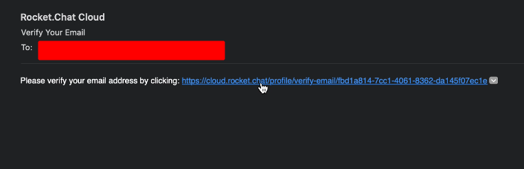
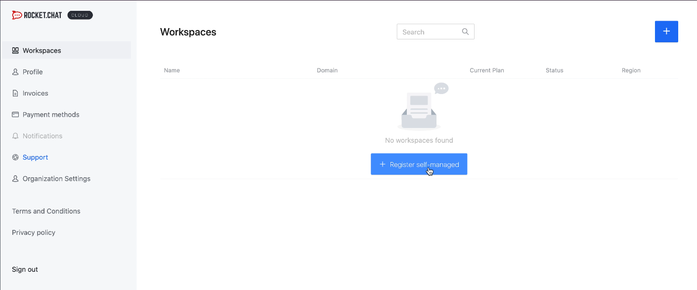
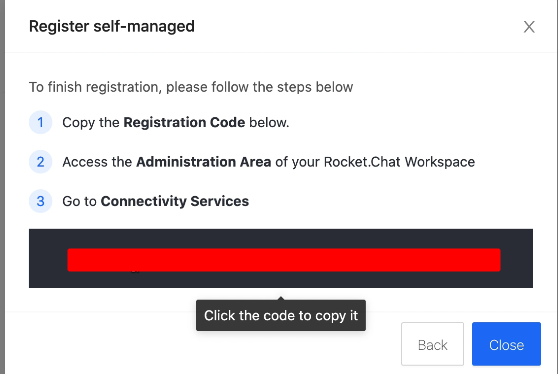
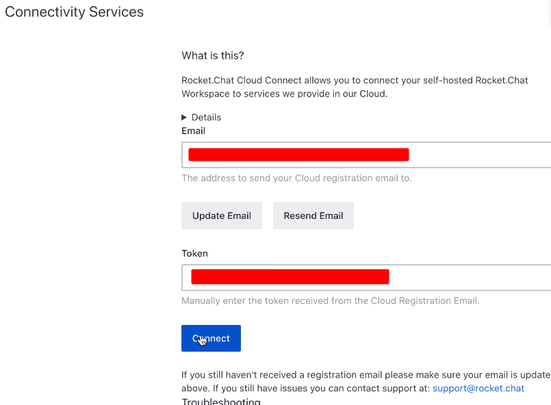
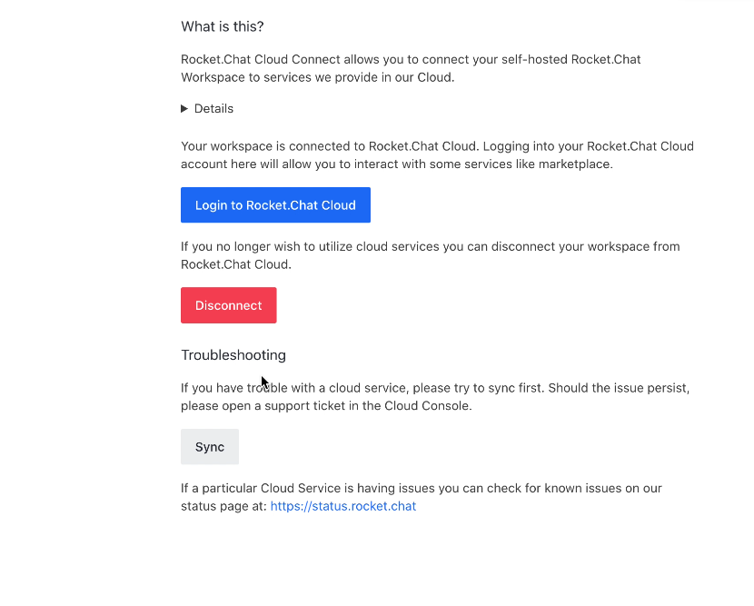
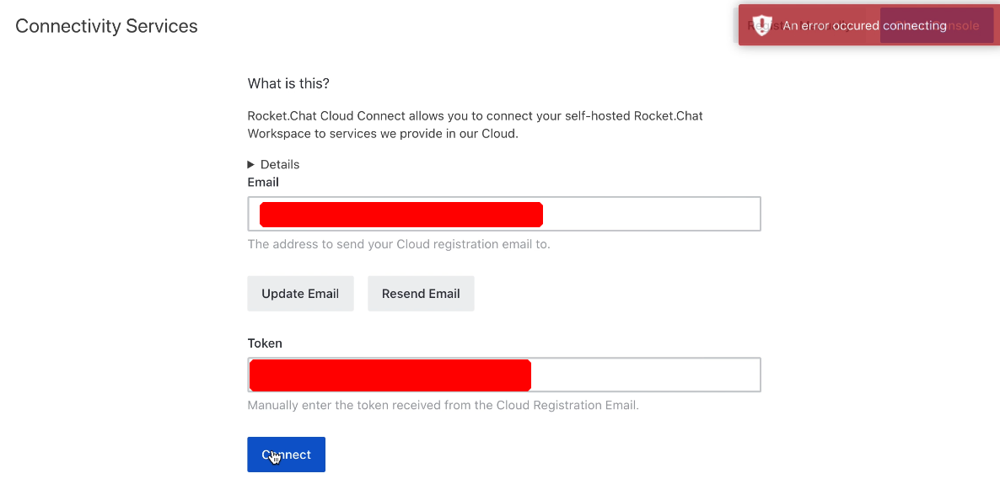
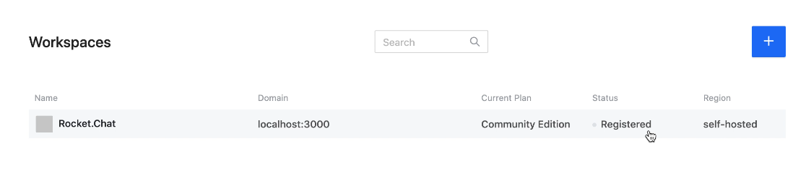

# Connectivity Services

## Introduction

Rocket.Chat Cloud provides a list of features/services such as

* [Rocket.Chat Push Notification Gateway](https://docs.rocket.chat/guides/administrator-guides/notifications/push-notifications#push-gateway)
* [Rocket.Chat Marketplace](https://rocket.chat/marketplace)
* Omnichannel proxy
* Automatic license synchronization 

In order to use those services, Rocket.Chat server must be connected to [cloud.rocket.chat](https://cloud.rocket.chat/). Below are the steps required to connect and synchronize a Rocket.Chat self hosted server to our cloud infrastructure.

#### Important 1: the steps below are required _only_ for self managed instances. Rocket.Chat SaaS workspaces are always connected to our Cloud infrastructure.

**Important 2: In order to connect your server to our Cloud, your Rocket.Chat server must be at least on version 1.3.2.**

## Registration steps

1. Go to [cloud.rocket.chat](https://cloud.rocket.chat/) and create a new account

2. Fill up the registration form and "Register"

3. A verification email will be sent in order to activate your new Cloud account 

4. The verification link will forward to cloud.rocket.chat. After the validation, you will be logged into your Cloud console. In order to register your self hosted workspace, please select the "Register self-managed" button

5. A pop-up will be displayed in order to select the workspace type: 

* Internet Access: Rocket.Chat server that has connection to the internet \(connected to the outside\)
* No Internet Access: Special cases where Rocket.Chat server has no connection at all \(totally air gapped\).

In this document we are covering only the "Internet Access" option

6. When selecting the "Internet Access" option, a registration token will be generated. Copy the token as this will be used to register your Rocket.Chat server.

7. On your Rocket.Chat server, go to _Administration &gt; Connectivity Services._   
Fill up the "Email" field with the email related to your Rocket.Chat Cloud account and the "Token" field please paste the registration token generated on the step \#6. Finally, hit the "Connect" button

8. The "Connect" button will set the connection between your Rocket.Chat server and Rocket.Chat Cloud console. When the connection is successful, the _Connectivity Services_ panel will look like this:

**Important: For some cases, the following error might be triggered after hitting the "Connect" button:**

**Please disregard this error as it is getting incorrectly triggered from Rocket.Chat server side.**

9. Finally, in order to ensure the synchronization between Rocket.Chat server and Rocket.Chat Cloud, hit the "Sync" button as this will trigger the synchronization framework. 

This is recommended right after registering your server. The newly registered workspace will be listed in the "Workspace" section at [cloud.rocket.chat](https://cloud.rocket.chat/)

