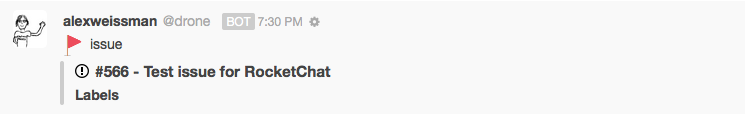

# GitHub

We can do 2 types of integrations with GitHub:

* Receive alerts from GitHub \(**Incoming WebHook**\)
* Send commands to GitHub and optionally receive a response \(**Outgoing WebHook**\)

## Receive alerts

1. Create a new **Incoming WebHook**
2. Select the channel where you will receive the alerts. You may wish to create a dedicated channel for your notifications.
3. Select an account from which the alerts will be posted. You may wish to create a dedicated account just for notifications.
4. Set the "Enable Scripts" option to `True`.
5. Copy-paste one of the example scripts below.
6. Save the integration. This will generate a webhook URL and secret for you.
7. Go to your repository `Settings -> WebHooks & services -> Add WebHook`
8. Paste your **WebHook URL** from Rocket.Chat into **Payload URL**
9. Keep **Content type** as `application/json`
10. Leave **Secret** empty and save

### Example script 1:

This script will generate notifications for the following repository events:

* Issue events \(create, edit, close, reopen, assign, label, etc\)
* Issue comment events
* Push events \(singular and multiple commits\)


```javascript
/* exported Script */

String.prototype.capitalizeFirstLetter = function() {
    return this.charAt(0).toUpperCase() + this.slice(1);
}

const getLabelsField = (labels) => {
  let labelsArray = [];
  labels.forEach(function(label) {
    labelsArray.push(label.name);
  });
  labelsArray = labelsArray.join(', ');
  return {
    title: 'Labels',
    value: labelsArray,
    short: labelsArray.length <= 40
  };
};

const githubEvents = {
  ping(request) {
    return {
      content: {
        text: '_' + request.content.hook.id + '_\n' + ':thumbsup: ' + request.content.zen
      }
    };
  },

  /* NEW OR MODIFY ISSUE */
  issues(request) {
    const user = request.content.sender;

    if (request.content.action == "opened" || request.content.action == "reopened" || request.content.action == "edited") {
        var body = request.content.issue.body;
    } else if (request.content.action == "labeled") {
        var body = "Current labels: " + getLabelsField(request.content.issue.labels).value;
    } else if (request.content.action == "assigned" || request.content.action == "unassigned") {
        // Note that the issues API only gives you one assignee.
        var body = "Current assignee: " + request.content.issue.assignee.login;
    } else if (request.content.action == "closed") {
        if (request.content.issue.closed_by) {
            var body = "Closed by: " + request.content.issue.closed_by.login;
        } else {
            var body = "Closed.";
        }
    } else {
        return {
          error: {
            success: false,
            message: 'Unsupported issue action'
          }
        };
    }

    const action = request.content.action.capitalizeFirstLetter();

    const text = '_' + request.content.repository.full_name + '_\n' +
                '**[' + action + ' issue ​#' + request.content.issue.number +
                ' - ' + request.content.issue.title + '](' +
                request.content.issue.html_url + ')**\n\n' +
                body;

    return {
      content: {
        attachments: [
            {
                thumb_url: user.avatar_url,
                text: text,
                fields: []
            }
        ]
      }
    };
  },

  /* COMMENT ON EXISTING ISSUE */
  issue_comment(request) {
    const user = request.content.comment.user;

    if (request.content.action == "edited") {
        var action = "Edited comment ";
    } else {
        var action = "Comment "
    }

    const text = '_' + request.content.repository.full_name + '_\n' +
                '**[' + action + ' on issue ​#' + request.content.issue.number +
                ' - ' + request.content.issue.title + '](' +
                request.content.comment.html_url + ')**\n\n' +
                request.content.comment.body;

    return {
      content: {
        attachments: [
            {
                thumb_url: user.avatar_url,
                text: text,
                fields: []
            }
        ]
      }
    };
  },

 /* COMMENT ON COMMIT */
commit_comment(request) {
    const user = request.content.comment.user;

    if (request.content.action == "edited") {
        var action = "Edited comment ";
    } else {
        var action = "Comment "
    }

    const text = '_' + request.content.repository.full_name + '_\n' +
                '**[' + action + ' on commit id ' + request.content.comment.commit_id +
                ' - ' +  + '](' +
                request.content.comment.html_url + ')**\n\n' +
                request.content.comment.body;

    return {
      content: {
        attachments: [
            {
                thumb_url: user.avatar_url,
                text: text,
                fields: []
            }
        ]
      }
    };
  },
  /* END OF COMMENT ON COMMIT */

  /* PUSH TO REPO */
  push(request) {
    var commits = request.content.commits;
    var multi_commit = ""
    var is_short = true;
    var changeset = 'Changeset';
    if ( commits.length > 1 ) {
      var multi_commit = " [Multiple Commits]";
      var is_short = false;
      var changeset = changeset + 's';
      var output = [];
    }
    const user = request.content.sender;

    var text = '**Pushed to ' + "["+request.content.repository.full_name+"]("+request.content.repository.url+"):"
                + request.content.ref.split('/').pop() + "**\n\n";

    for (var i = 0; i < commits.length; i++) {
      var commit = commits[i];
      var shortID = commit.id.substring(0,7);
      var a = '[' + shortID + '](' + commit.url + ') - ' + commit.message;
      if ( commits.length > 1 ) {
        output.push( a );
      } else {
        var output = a;
      }
    }

    if (commits.length > 1) {
      text += output.reverse().join('\n');
    } else {
      text += output;
    }

    return {
      content: {
        attachments: [
            {
                thumb_url: user.avatar_url,
                text: text,
                fields: []
            }
        ]
      }
    };
  },  // End GitHub Push

  /* NEW PULL REQUEST */
  pull_request(request) {
    const user = request.content.sender;

   if (request.content.action == "opened" || request.content.action == "reopened" || request.content.action == "edited" || request.content.action == "synchronize") {
        var body = request.content.pull_request.body;
    } else if (request.content.action == "labeled") {
        var body = "Current labels: " + getLabelsField(request.content.pull_request.labels).value;
    } else if (request.content.action == "assigned" || request.content.action == "unassigned") {
        // Note that the issues API only gives you one assignee.
        var body = "Current assignee: " + request.content.pull_request.assignee.login;
    } else if (request.content.action == "closed") {
        if (request.content.pull_request.merged) {
            var body = "Merged by: " + request.content.pull_request.merged_by.login;
        } else {
            var body = "Closed.";
        }
    } else {
        return {
          error: {
            success: false,
            message: 'Unsupported pull request action'
          }
        };
    }

    const action = request.content.action.capitalizeFirstLetter();

    const text = '_' + request.content.repository.full_name + '_\n' +
                '**[' + action + ' pull request ​#' + request.content.pull_request.number +
                ' - ' + request.content.pull_request.title + '](' +
                request.content.pull_request.html_url + ')**\n\n' +
                body;

    return {
      content: {
        attachments: [
            {
                thumb_url: user.avatar_url,
                text: text,
                fields: []
            }
        ]
      }
    };
  },
};

class Script {
  process_incoming_request({ request }) {
    const header = request.headers['x-github-event'];
    if (githubEvents[header]) {
      return githubEvents[header](request);
    }

    return {
      error: {
        success: false,
        message: 'Unsupported method'
      }
    };
  }
}
```

#### Example script 2:

This script will generate notifications for the following repository events:

* New and closed issue events
* Comment events \(issues only\)
* Push events \(singular and multiple commits\)



```javascript
/* exported Script */

// Begin embedded images
const gh_cmit_svg = '<svg xmlns="http://www.w3.org/2000/svg" aria-hidden="true" class="octicon octicon-git-commit" height="16" version="1.1" viewBox="0 0 14 16" width="14"><path d="M10.86 7c-.45-1.72-2-3-3.86-3-1.86 0-3.41 1.28-3.86 3H0v2h3.14c.45 1.72 2 3 3.86 3 1.86 0 3.41-1.28 3.86-3H14V7h-3.14zM7 10.2c-1.22 0-2.2-.98-2.2-2.2 0-1.22.98-2.2 2.2-2.2 1.22 0 2.2.98 2.2 2.2 0 1.22-.98 2.2-2.2 2.2z"></path></svg>';
const gh_pr_svg = '<svg xmlns="http://www.w3.org/2000/svg" aria-hidden="true" class="octicon octicon-git-pull-request" height="16" version="1.1" viewBox="0 0 12 16" width="12"><path d="M11 11.28V5c-.03-.78-.34-1.47-.94-2.06C9.46 2.35 8.78 2.03 8 2H7V0L4 3l3 3V4h1c.27.02.48.11.69.31.21.2.3.42.31.69v6.28A1.993 1.993 0 0 0 10 15a1.993 1.993 0 0 0 1-3.72zm-1 2.92c-.66 0-1.2-.55-1.2-1.2 0-.65.55-1.2 1.2-1.2.65 0 1.2.55 1.2 1.2 0 .65-.55 1.2-1.2 1.2zM4 3c0-1.11-.89-2-2-2a1.993 1.993 0 0 0-1 3.72v6.56A1.993 1.993 0 0 0 2 15a1.993 1.993 0 0 0 1-3.72V4.72c.59-.34 1-.98 1-1.72zm-.8 10c0 .66-.55 1.2-1.2 1.2-.65 0-1.2-.55-1.2-1.2 0-.65.55-1.2 1.2-1.2.65 0 1.2.55 1.2 1.2zM2 4.2C1.34 4.2.8 3.65.8 3c0-.65.55-1.2 1.2-1.2.65 0 1.2.55 1.2 1.2 0 .65-.55 1.2-1.2 1.2z"></path></svg>';
const gh_iss_svg = '<svg xmlns="http://www.w3.org/2000/svg" aria-hidden="true" class="octicon octicon-issue-opened" height="16" version="1.1" viewBox="0 0 14 16" width="14"><path d="M7 2.3c3.14 0 5.7 2.56 5.7 5.7s-2.56 5.7-5.7 5.7A5.71 5.71 0 0 1 1.3 8c0-3.14 2.56-5.7 5.7-5.7zM7 1C3.14 1 0 4.14 0 8s3.14 7 7 7 7-3.14 7-7-3.14-7-7-7zm1 3H6v5h2V4zm0 6H6v2h2v-2z"></path></svg>';
const svg_inline_prefix = 'data:image/svg+xml;ascii,';
// End embedded images

const getLabelsField = (labels) => {
  let labelsArray = [];
  labels.forEach(function(label) {
    labelsArray.push(label.name);
  });
  labelsArray = labelsArray.join(', ');
  return {
    title: 'Labels',
    value: labelsArray,
    short: labelsArray.length <= 40
  };
};

const githubEvents = {
  ping(request) {
    return {
      content: {
        text: ':thumbsup: ' + request.content.zen
      }
    };
  },

  issues(request) {
    const user = request.content.sender;
    const attachment = {
      author_icon: svg_inline_prefix + gh_iss_svg,
      author_name: '#' + request.content.issue.number + ' - ' + request.content.issue.title,
      author_link: request.content.issue.html_url,
      fields: []
    };

    if (request.content.issue.labels) {
      attachment.fields.push(getLabelsField(request.content.issue.labels));
    }

    if (request.content.issue.assignee) {
      attachment.fields.push({
        title: 'Assignee',
        value: request.content.issue.assignee.login,
        short: true
      });
    }

    const actions = {
      'assigned': ':inbox_tray:',
      'unassigned': ':outbox_tray:',
      'opened': ':triangular_flag_on_post:',
      'closed': ':white_check_mark:',
      'reopened': ':triangular_flag_on_post:',
      'labeled': ':label:',
      'unlabeled': ':label:',
      'edited': ':pencil:'
    };

    const text = actions[request.content.action] + ' issue';

    return {
      content: {
        icon_url: user.avatar_url,
        alias: user.login,
        text: text,
        attachments: [attachment]
      }
    };
  },

  issue_comment(request) {
    const user = request.content.comment.user;
    var attachment = {
      author_icon: svg_inline_prefix + gh_iss_svg,
      author_name: '#' + request.content.issue.number + ' - ' + request.content.issue.title,
      author_link: request.content.comment.html_url,
      fields: []
    };

    if (request.content.issue.labels) {
      attachment.fields.push(getLabelsField(request.content.issue.labels));
    }

    if (request.content.issue.assignee) {
      attachment.fields.push({
        title: 'Assignee',
        value: request.content.issue.assignee.login,
        short: true
      });
    }

    const text = ':speech_balloon: ' + request.content.comment.body;

    return {
      content: {
        icon_url: user.avatar_url,
        alias: user.login,
        text: text,
        attachments: [attachment]
      }
    };
  },

  pull_request(request) {
    const user = request.content.sender;
    const attachment = {
      author_icon: svg_inline_prefix + gh_pr_svg,
      author_name: '#' + request.content.pull_request.number + ' - ' + request.content.pull_request.title,
      author_link: request.content.pull_request.html_url
    };

    let text = 'Pull request';
    switch (request.content.action) {
      case 'assigned':
        text += ' assigned to: ' + request.content.assignee.login;
        break;
      case 'unassigned':
        text += ' unassigned of ' + request.content.assignee.login;
        break;
      case 'opened':
        text += ' opened';
        break;
      case 'closed':
        if (request.content.pull_request.merged) {
          text += ' merged';
        } else {
          text += ' closed';
        }
        break;
      case 'reopened':
        text += ' reopened';
        break;
      case 'labeled':
        text += ' added label: "' + request.content.label.name + '" ';
        break;
      case 'unlabeled':
        text += ' removed label: "' + request.content.label.name + '" ';
        break;
      case 'synchronize':
        text += ' synchronized';
    }

    return {
      content: {
        icon_url: user.avatar_url,
        alias: user.login,
        text: text,
        attachments: [attachment]
      }
    };
  },

  //// GitHub push event
  push(request) {
    var commits = request.content.commits;
    var multi_commit = ""
    var is_short = true;
    var changeset = 'Changeset';
    if ( commits.length > 1 ) {
      var multi_commit = " [Multiple Commits]";
      var is_short = false;
      var changeset = changeset + 's';
      var output = [];
    }
    const user = request.content.sender;
    const attachment = {
    author_icon: svg_inline_prefix + gh_cmit_svg,
      author_name: "Message: " + request.content.head_commit.message + multi_commit,
      author_link: request.content.compare,
      fields: []
    };

    if (request.content.repository.full_name) {
      attachment.fields.push({
        title: 'Repo',
        value: "["+request.content.repository.full_name+"]("+request.content.repository.url+")",
        short: is_short
      });
    }

    for (var i = 0; i < commits.length; i++) {
      var commit = commits[i];
      var shortID = commit.id.substring(0,7);
      if ( commits.length > 1 ) {
        output = '[' + shortID + '](' + commit.url + ') - ' + commit.message
        if (i == 0){
            attachment.fields.push({
                title: changeset,
                value: output,
                short: is_short
            });
        } else{
            attachment.fields.push({
                title: changeset,
                value: output,
                short: is_short
            });
        }
      } else {
        output = "[" + shortID + "](" + commit.url + ")"
        attachment.fields.push({
            title: changeset,
            value: output,
            short: is_short
        });
      }
    }

    const text = ':ballot_box_with_check: Pushed to ' + "["+request.content.ref.split('/').pop()+"]";

    return {
      content: {
        icon_url: user.avatar_url,
        alias: user.login,
        text: text,
        attachments: [attachment]
      }
  };
  },  // End GitHub Push
};

class Script {
  process_incoming_request({ request }) {
    const header = request.headers['x-github-event'];
    if (githubEvents[header]) {
      return githubEvents[header](request);
    }

    return {
      error: {
        success: false,
        message: 'Unsupported method'
      }
    };
  }
}
```

#### Customizing your integration scripts

The purpose of the integration script is to transform data in one format \(the format provided by your incoming service, such as GitHub\) into another format \(the format expected by Rocket.Chat\). Therefore, should you wish to customize either of the scripts presented above, you will need two resources:

* [GitHub API specifications](https://developer.github.com/v3/)
* [Specifications for Rocket.Chat integration message objects](https://github.com/RocketChat/docs/tree/0492569ecfbb133bf76abc8166af5d5c15166ec9/administrator-guides/integrations/index.html#incoming-script-details)

Note that data comes _into_ your script from GitHub as the `request.content` object.

### Send commands to GitHub

`This script only works for public repositories`

* Create a new **Outgoing WebHook**
* Select the channel where you will use the commands and receive the responses
* Set **URLs** as `https://api.github.com/repos/User-Or-Org-Name/Repo-Name` like `https://api.github.com/repos/RocketChat/Rocket.Chat`
* Enable Scripts
* Use this **Script** to listen for commands `pr ls`, `pr list` and `help`

```javascript
    /* exported Script */
    /* globals Store */

    class Script {
      prepare_outgoing_request({ request }) {
        let match;

        console.log('lastCmd', Store.get('lastCmd'));

        match = request.data.text.match(/^pr last$/);
        if (match && Store.get('lastCmd')) {
          request.data.text = Store.get('lastCmd');
        }

        match = request.data.text.match(/^pr\s(ls|list)\s*(open|closed|all)?$/);
        if (match) {
          Store.set('lastCmd', request.data.text);
          let u = request.url + '/pulls';
          if (match[2]) {
            u += '?state='+match[2];
          }
          return {
            url: u,
            headers: request.headers,
            method: 'GET'
          };
        }

        match = request.data.text.match(/^help$/);
        if (match) {
          Store.set('lastCmd', request.data.text);
          return {
            message: {
              text: [
                '**GitHub commands**',
                '```',
                  '  pr ls|list [open|closed|all]  List Pull Requests',
                '```'
              ].join('\n')
            }
          };
        }
      }

      process_outgoing_response({ request, response }) {
        var text = [];
        response.content.forEach(function(pr) {
          text.push('> '+pr.state+' [#'+pr.number+']('+pr.html_url+') - '+pr.title);
        });

        return {
          content: {
            text: text.join('\n'),
            parseUrls: false
          }
        };
      }
    }
```

* Save your integration

