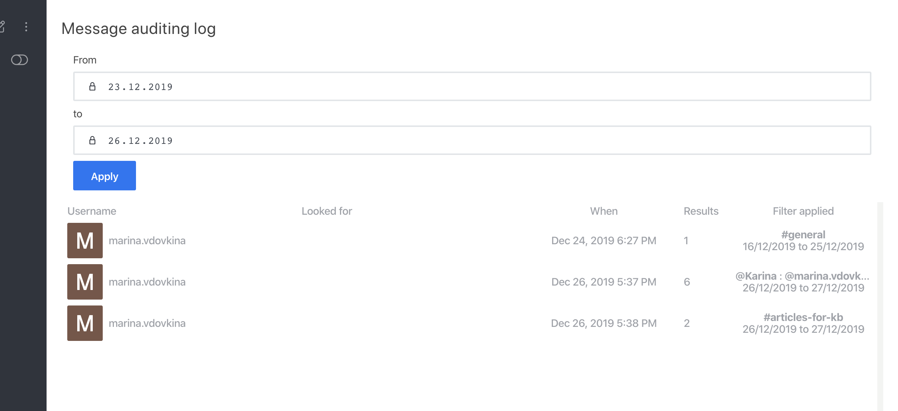
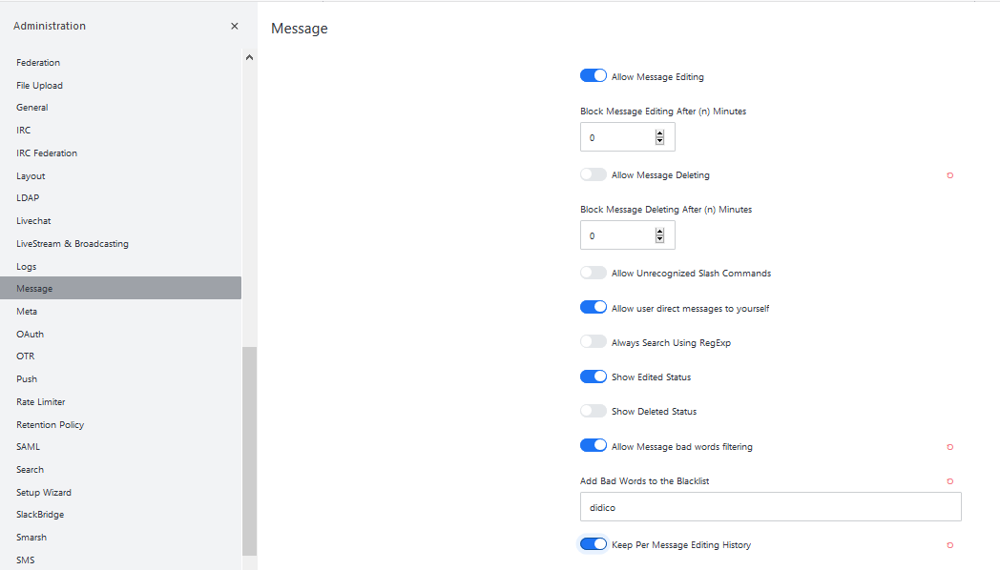

# Message Auditing Panel

It allows the authorized user to:

* Review messages between users in the Message Auditing Panel.
* Check details in the Auditing Log about the individuals who used the Message Auditing Panel.


Note that the auditor does not have to be a participant in the room to be able to read the messages. 


To access the message auditing panel:

1. Click your user icon
2. Click **Message Auditing**

as shown below:

The message auditing panel will open up, as shown below:

## Search and Review Messages 

### By Channel

To search for a specific message in a specific channel:

1. Type the message string that you could remember in the **Message** field. 
2. Enter the from and to dates under **Date** to specify the period of time in which you think the message was sent.  Or you can use a specific period from the drop-down next to Date.
3. Select the channels in the **Channel** dropdown, to narrow the details of your search.
4. Hit **Apply**.

### By User

To search for a specific message by a user:

1. Type the message string that you want to check \(e.g. abusive language\) in the **Message** field. 
2. Enter the from and to dates under **Date** to specify the period of time in which you think the message was sent. Or you can use a specific period from the drop-down next to Date.
3. Enter username whose message you want to check in the **Users** field. 
4. Hit **Apply**.

The conversations pops up, as shown below:

### By Direct Messages

To search for a specific message by a user:

1. Type the message string that you want to check in the **Message** field. \(optional\)
2. Enter the from and to dates under **Date** to specify the period of time. Or you can use a specific period from the drop-down next to Date.
3. Enter atleast two usernames whose private you want to check in the **Users** field. 
4. Hit **Apply**.

The conversation pop up, as shown below:

### By Omnichannel

Similary you can also audit an omnichannel conversation.

To search for a specific omichannel conversation:

1. Type the message string that you want to check in the **Message** field. 
2. Enter the from and to dates under **Date** to specify the period of time. Or you can use a specific period from the drop-down next to Date.
3. Enter the visitor's in **Visitor** field.
4. Enter the agent's name who served this conversation you are looking for in **Agent** field. 
5. Hit **Apply**.

The conversation pops up, as shown below:

## Review the Message Auditing Log

To check the details about who used the Message Auditing Panel and their search results, you must have the `auditor-log` role or the `can-audit-log` permission.

## Check Historical Edits and Deletions

Rocket.Chat recommends the following setting preferences to enable you to view any modified or removed messages.

* Got to the Administration UI .
* Click **Administration**.
* Scroll down to **Messages** on the left-side menu.

Make sure to set your message preferences as follows:

* Enable **Allow Message Editing** and **Keep Per Message Editing History** to see a history of all messages and not only the last edit made.
* Disable **Allow Message Deleting**, otherwise messages show only the _message deleted_ status and you cannot see the complete message history.

## Assign Message Auditing Permissions to Specific Users

The Auditor or Auditor Log roles have permissions to use Message Auditing features.

You assign permissions to use the Message Auditing Panel or Auditing Log to such roles as the Admin role.

On the **Permissions** screen in the Administration UI, do the following to assign access:

* For access to the Message Auditing Panel, select the `can-audit` option.
* For access to the Message Auditing Log, select the `can-audit-log` option.

## 

