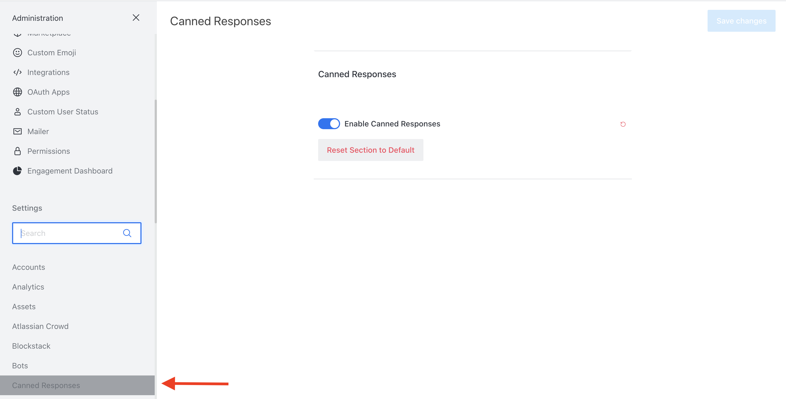
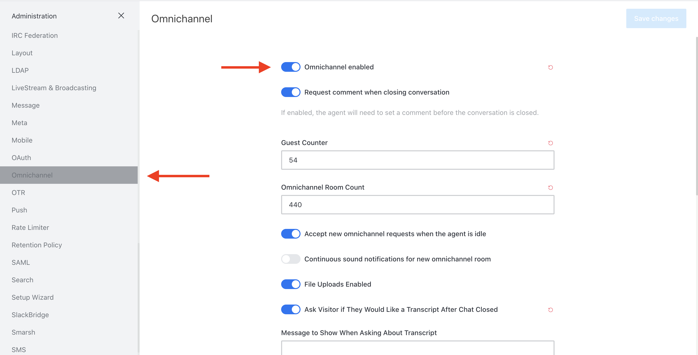
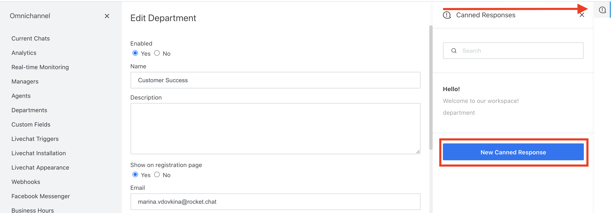
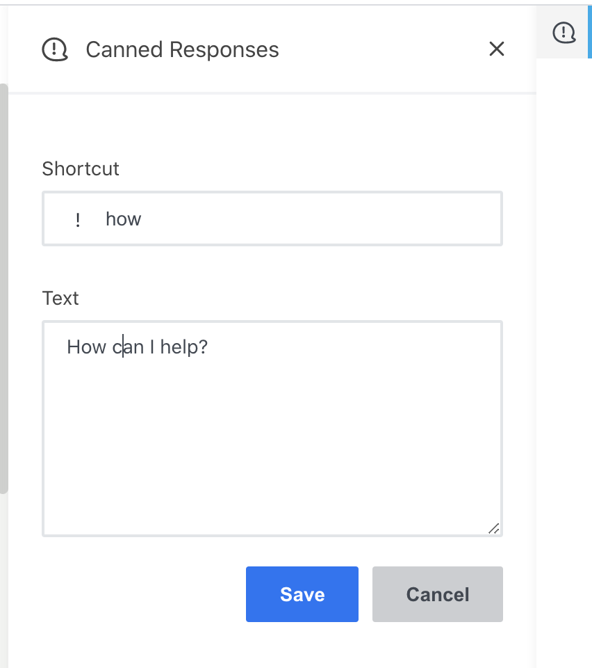
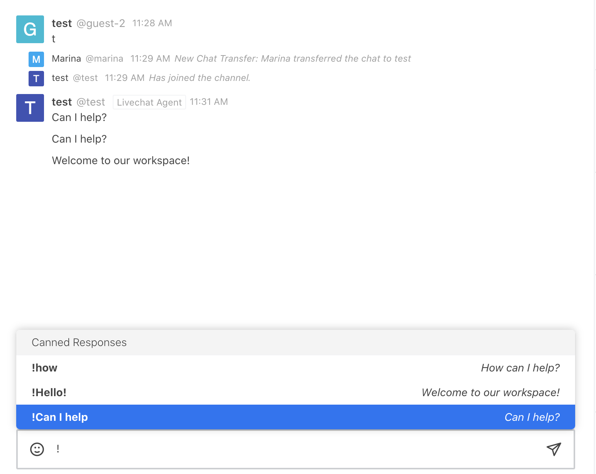
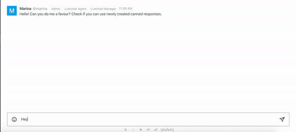

# Canned responses

Canned responses allow you to save message snippets that you can call with shortcuts \(preceded with `!`\) to communicate a quick note to your visitors in Omnichannel and for messaging in regular conversations inside your Rocket.Chat workspace. 

Follow the steps to set up the canned responses:

Enable the feature under `Administration` -&gt; `Canned Responses`. 

Define which user roles should be able to view, create and delete the canned responses. Go to `Administration` -&gt; `Permissions` and use search to filter the canned responses permissions only:

Enable `Omnichannel`. Using canned responses in regular conversations with other users of your workspace will require Omnichannel feature to be enabled. 

Select the department. Canned responses can be created **per department** as shown below**,** or **per agent** right in an omnichannel conversation. ****Click on the canned responses icon \(top right corner\) to create a new canned response.

_If you want to use canned responses outside the Omnichannel, create an empty department. Note that you will need to define which user roles should be able to use the responses; by default this permission is assigned to livechat-agent, livechat-manager, livechat-monitor and admin roles_

Create a canned response:

**by editing a department:**

Fill in the shortcut and the text fields. Click Save and observe your new snippet appear in the list of available canned responses.

**directly in an Omnichannel conversation**:

Try using a canned response in a conversation. Start your message with `!` and a shortcut, or simply select the canned response from the drop-down list that will appear above your text field:

You can also use the same canned responses when talking to your peers outside Omnichannel. 

To delete or edit a canned response, open the canned responses dialog in the respective department. Select the response that you wish to delete or edit. 

