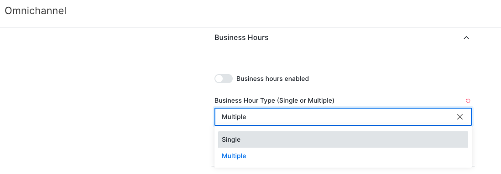
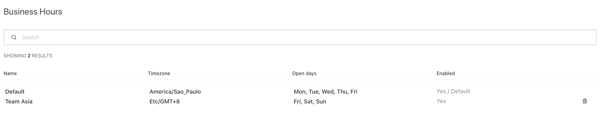

# Multiple Business Hours

This implementation adds the ability to set up multiple `Business Hours` configurations. A new setting will define the behavior of the `Business Hours` system. There are two options available:

* Single: This setting manages all Omnichannel agents. This option is suitable when there is only one team of agents.
* Multiple: This setting allows managers to set up multiple `Business Hours` configurations. This option is suitable when then Teams of agents are grouped per department. Each department is allowed to have just one `Business Hour` configuration.

Another long-awaited feature launched by this implementation is the ability to define different timezones by `Business hours`

### Configuration

New setting to define the behavior of the new Business Hours system:

Go to Omnichannel &gt; Business Hours

