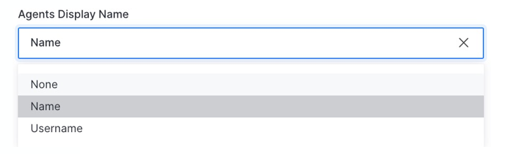
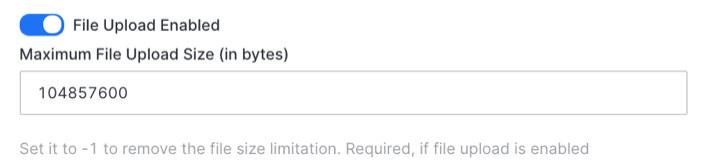
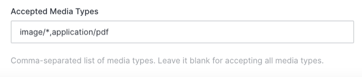
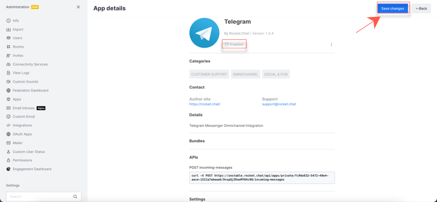

# Telegram App Configuration

Search Telegram in the **Apps** menu on your Rocket.Chat administration panel, as shown below:

.png>)

Click open your Telegram app to see the settings available to you as an administrator:&#x20;

The following are the settings available:

1. **Bot Token** sent by Telegram during Bot user activation. If you need help creating your telegram bot token, you can find the [instructions](https://docs.rocket.chat/guides/app-guides/omnichannel-apps/telegram-app/telegram-app-configuration/generate-your-telegram-bot-token) here

Other Settings include:

2\. You can set a **Default Department**. Only the agents of this department are able to serve Telegram conversations


If you don't have a department set up you won't receive any message.



Find out how to [create a department](https://docs.rocket.chat/guides/omnichannel/departments) for your Rocket.Chat workspace.


3\. You can set the **Service Unavailable Message** that will be sent to the user if some error occurs like if no agents are online

4\. You can set the **Welcome Message** that will be sent to visitors when they send their first message

5\. The **Conversation Finished Message** will be sent to visitors when the conversation is closed


Only the agents of that particular department are able to see and take the chats.


&#x20;

.png>)

6\.  You can choose to display the agent's name or username:

7\. You can enable/disable file sharing and also set a limit for maximum upload size

8\. And you can select the type of files you wish the Agents and your Telegram Contacts can share under **Accepted Media Types**

9\. Hit **Save Changes** to save your settings and your Telegram app is successfully configured.

&#x20;You can see the new Telegram channel upon closing the administration panel.

### Quick Replies

You can also use quick reply buttons to send/receive quick replies on telegram.


Please note that, for this configuration, you need to have a bot ([Dialogflow](https://docs.rocket.chat/guides/app-guides/omnichannel-apps/dialogflow-app)/[RASA](https://docs.rocket.chat/guides/app-guides/omnichannel-apps/rasa-app)) configured.


You also need to have [**Assign new conversations to bot agent**](https://docs.rocket.chat/guides/administration/settings/omnichannel-admins-guide#routing) **** toggled on for the setting to work&#x20;

