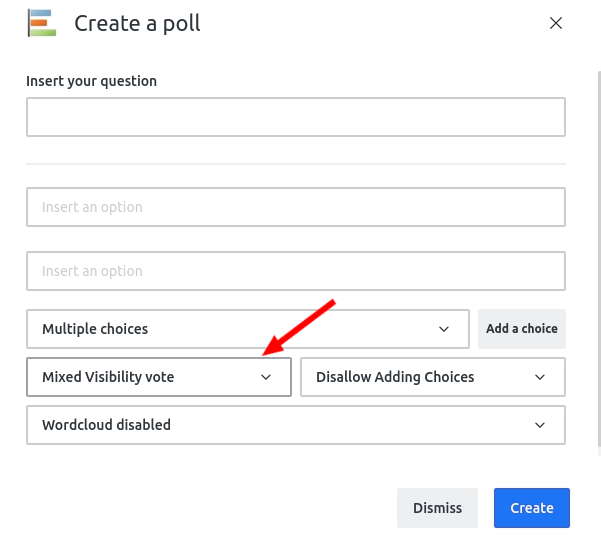
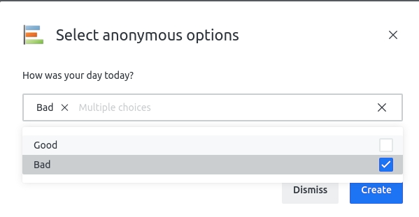
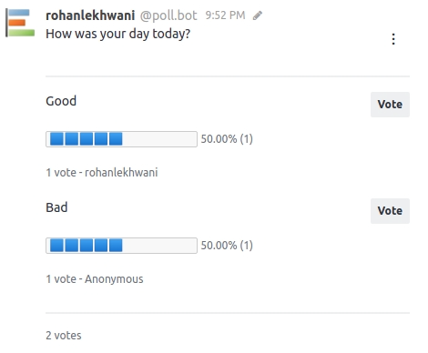

# Mixed Visibility Polls

In addition to the open and confidential visibilities which affects all Poll options, you can also set the visibility of specific Poll options to be confidential and the remaining to be open.

To enable Mixed Visiblity, set the visibility to **"Mixed Visibility Vote"** within the Poll creation modal.

On clicking **Create**, the Mixed Visibility modal pops open. It allows you select all of the options you would like to be "Anonymous".

Click **Create** to post the Poll within the room. Options that were selected to be "Anonymous" will conceal the voter identities with the "Anonymous" label.

**Note** - Votes casted on the options marked "Anonymous" **would still** be counted within the total votes \(2 in the above image\).

