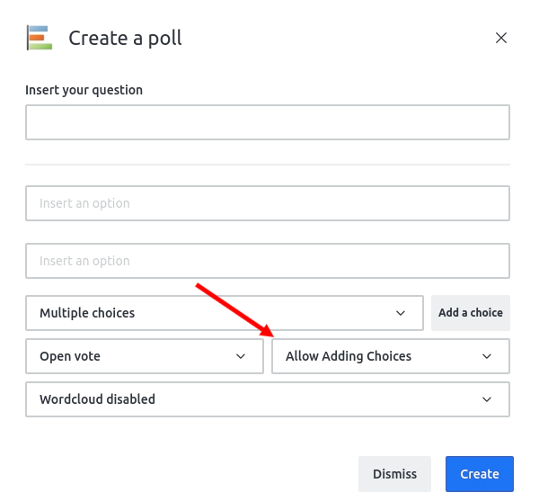
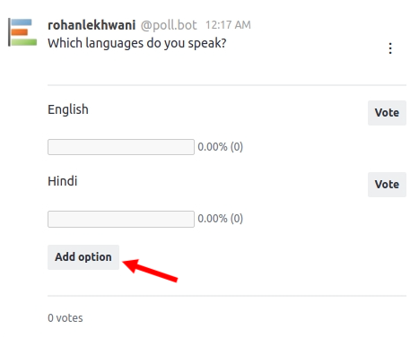
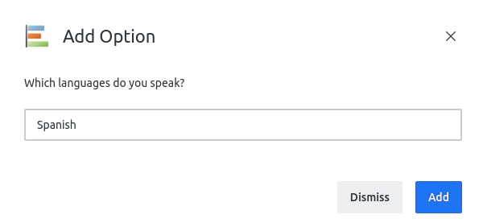

# User Defined Options

The Poll Plus App provides the poll creator to allow or disallow users from adding options to an already created poll.

During poll creation, the creator can choose to allow or disallow users to add options to the poll.

If **"Adding Choices"** are allowed, an **Add Choice** button is displayed for the duration of the poll.

Clicking the **Add Choice** button will open a new modal for the user to add their option.

The new option now becomes available to the entire room with 0 votes and 0 voters assigned to it.
