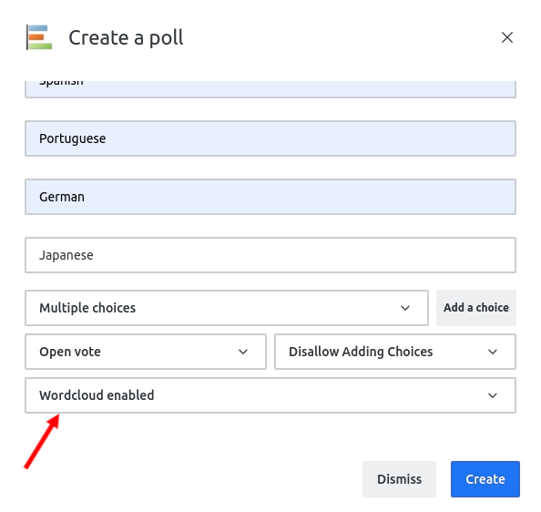

# Word Cloud

In addition to the bar graph generated, the Poll Plus App provides users with the option to summarize the poll results in a word cloud.

The word cloud feature makes use of a word cloud API for fetching these. If you haven't set a word cloud API to be used, please refer to the [configuration guide](../poll-plus-app-configuration/settings.md) for more information.

Word Cloud can be enabled by setting the word cloud property to **enabled** within the poll creation modal.

A complete user-flow for the word cloud feature has been shown below:

