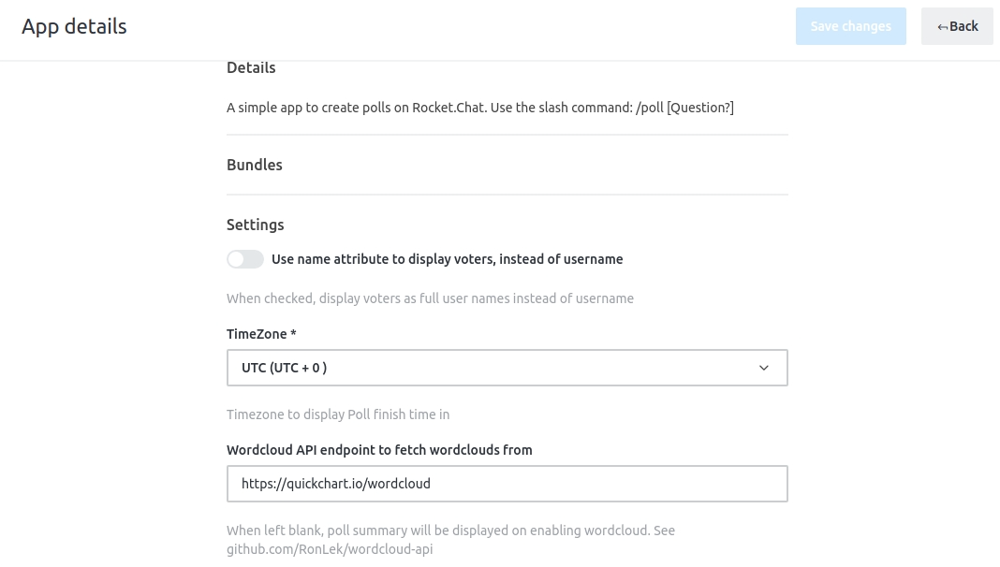

# Settings

The Poll Plus app offers customization options through the App details page. 

- Go to **Administration &gt; Apps &gt; Poll Plus**.
- Navigate to the **Settings** section.

### Use Name Attribute
The Poll Plus App provides you with an option to display the voter identity as either the full name or the username of the voter.

### Timezone
Since Rocket.Chat is used globally, not everyone might be comfortable with UTC. The Poll Plus App allows you to choose which timezone the poll finish times would be displayed in.

The default value for this setting is the UTC timezone.

### Word Cloud API
The [word cloud](../guides/word-cloud.md) feature uses an API link to fetch word clouds from. For small servers the free version of [Quickchart word cloud API](http://quickchart.io/documentation/word-cloud-api/) can be used. This is also the default value for this setting. Quickchart comes with the following restrictions:
- Requires Internet access.
- Enforces rate-limiting of 60 requests per minute per IP.

In the case, you are hosting your own Rocket.Chat **on-premise** or need **more customization** than Quickchart we've open-sourced an in-house developed word cloud API. This can be found at https://github.com/RonLek/wordcloud-api. The features that come along with using this are:
- No Internet access required.
- No rate-limiting.
- Free forever.

In the event you leave this field blank, the poll summary is displayed on finishing the poll when the word cloud is set to enabled.
