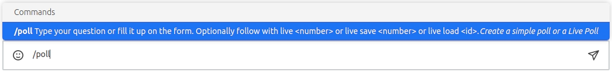
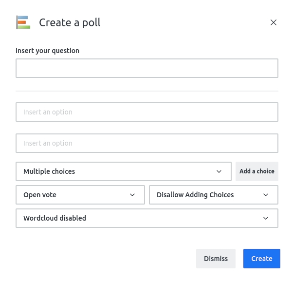
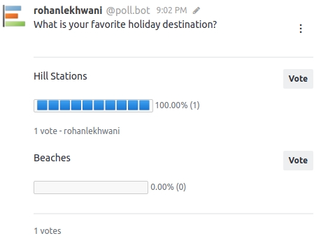
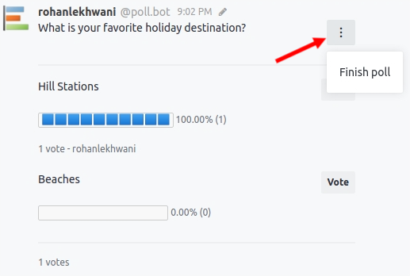

## Quickstart

After the installation, the Poll app will be available by using the slash command `/poll` in the message box of the channel you want to create the poll

This page demonstrates a very basic usage of the Poll app. For more advanced usage and to explore the Poll App's complete capabilities, please refer to the [Guides](/guides/mixed-visibility-polls.md) section.

After executing the `/poll` command, a pop-up will be triggered for the user to create the poll as below:

- **Insert your question:** Field to add the question related to the poll.
- **Options field:** The options available to reply the poll.
- **Choice type:** Select if the poll will be single or multiple choice or any of the template based polls.
- **Add a choice:** Here you can add as many options you need for the poll if the poll type is single or multiple choice.
- **Vote type:** You can decide if the poll will have "open vote", "confidential vote" or "mixed vote".
- **User-defined options:** Allow/disallow the user to add their own options to the poll.
- **Word Cloud:** Enable/disable the wordcloud feature on poll finish.

After creating the poll, the same will be available within the channel/room for the users to vote

In order to finish the poll, select the options menu available in the poll itself and select "Finish poll"

## What's Next?
- [Configure](./poll-plus-app-configuration/settings.md) your Poll App using the Poll App settings.
- For advanced usage, check out the [Guides](./guides/mixed-visibility-polls.md).
