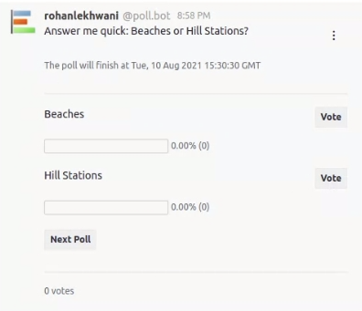

# Live Poll

Live Polls are an array of regular polls. A Live Poll is a **multi-question, timed** poll.

Live Polls can be trigerred with the `/poll live <number of polls>` command. Here `<number of polls>` denotes the number of polls you want to be included within the Live Poll.

Each poll within a Live Poll has a time limit to vote upon after which the current Poll ends and the next one is posted. Poll creators can also click on the **“Next Poll”** button to trigger a pre-scheduled finish of the current Poll.

The **"Time limit to vote"** each poll is set as the number of seconds you want that poll to be active.

Some excellent use-cases for the Live Poll are stand-up and retro meetings. An additional use case is by teachers wanting to conduct timed quizzes on Rocket.Chat.

Here is how the Live Poll looks in action. The time at which the Poll will end is shown in the below figure.

If you're outside of the UTC timezone, you can configure the Poll App to use your timezone. Refer the [configuration doc](../poll-app-configuration/settings.md) for more information.

## Late Retrieval

Live Polls include an additional feature called **Late Retrieval**. This allows Live Polls to be posted at a later time in the future.

To use the Late Retrieval feature make use of the `save` subcommand in the format: `/poll live save <number of polls>` where `<number of polls>` denote the number of polls you want to be included within the Live Poll.

Post-creation of the Live Poll, a message along with the **poll id** to retrieve it will be visible only to the poll creator.

Make use of the `/poll live load <id>` command to "play" the Live Poll. Here `<id>` is the poll id that was visible to the poll creator.

In case the user enters a wrong or non-existent Live Poll ID a notification message, only visible to the user, is sent within the room.

Speaking of teachers using Rocket.Chat for exams, the Live Poll Late Retrieval features proves an excellent tool for teachers to create quizzes even weeks before and then schedule the quiz on D-day with ease. All this while having control over the time limit to answer each question.
