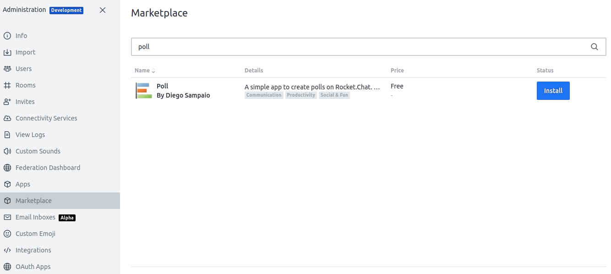

# Installation

Here you will find information on how to install and use the Poll App.

You can install our _Poll_ Rocket.Chat App from your Rocket.Chat Administration area.

- Go to **Administration &gt; Marketplace**.
- Search for the **Poll** app and click on the item.
- Click on the **Install** button.

## What's Next?
- Head over to [Quickstart](./quickstart.md) to see the Poll App in action.
- [Configure](./poll-app-configuration/settings.md) your Poll App using the Poll App settings.
- For advanced usage, check out the [Guides](./guides/mixed-visibility-polls.md).
