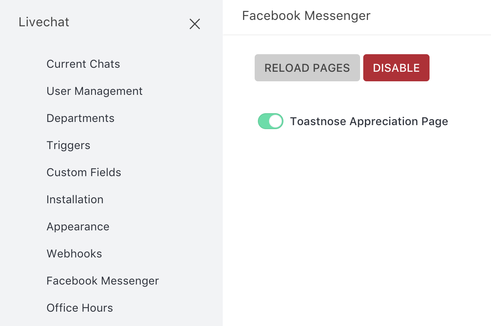

# Bitbucket Server

Here you will find how to install and use the Bitbucket Server Integration.

## Installation

You can install our Bitbucket Server Integration Rocket.Chat App from your Rocket.Chat Administration area.

* Go to **Administration &gt; Marketplace**
* Search for the **Bitbucket Server Integration** and click on the item
* Click on the **Install** button
* Click on **Activate**

Now that you have the app installed in your server, it is time to configure the integration with your Bitbucket instance.

## Configuration

In order to enable notifications, you have to connect a channel or private group to one or more Bitbucket repositories; To connect the channel or private group, access it and execute the slashcommand `/bitbucket-server connect REPO_URL`, where:

* **REPO\_URL**: is the url of the repository you want to connect to, e.g. `http://example.com:7990/bitbucket/projects/PROJECT_1/repos/repo1/browse`.

You will receive an ephemeral message with further instructions on how to add a Webhook to your Bitbucket repository.

Now go to your Bitbucket repository and [create a new Webhook](https://confluence.atlassian.com/bitbucketserver/managing-webhooks-in-bitbucket-server-938025878.html). In the URL field, paste the URL that was generated for you in the ephemeral message \(e.g., `https://example.com:3000/api/apps/private/d98e7da9-2398-4bd1-a596-d5cac28468bd/zC5r4DxBQSTHfrhLg/webhook?repoId=aHR0cDovL2xcY2FsaG9zdDo30TkwL2Jpd6J1Y2t1dHxQUk9KRUNUXzF8cmVwzE=`\)

After that Bitbucket will send notifications on some events to the connected channel or private room.

> **Note**: Only some of the available events are interpreted by the Rocket.Chat App. Those are **Repository Push, Pull Request Opened, Approved, Merged** and **Declined**. Any webhook sent to Rocket.Chat from other events will not result in any kind of notification being sent.

### Tips

* If you want to connect the same repository to another channel or private group, simply repeat the process on them, using the same repository URL;

