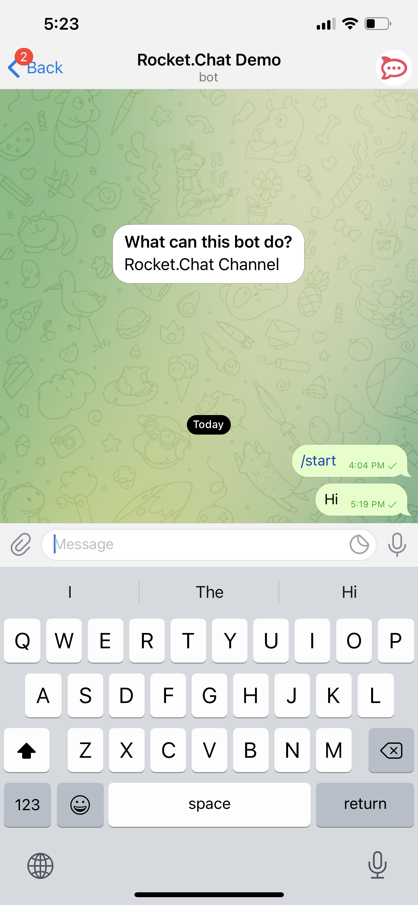

# Telegram App Agent's Guide

If you have Telegram app integration in place and a user sends you a message on your Telegram business page using their Telegram account, as shown below:

it appears in your Rocket.Chat workspace just like any other omnichannel conversation.

 Click **Take It!** to serve this conversation. You can also send to and receive files and voice notes from your Telegram end-user, as shown below:

