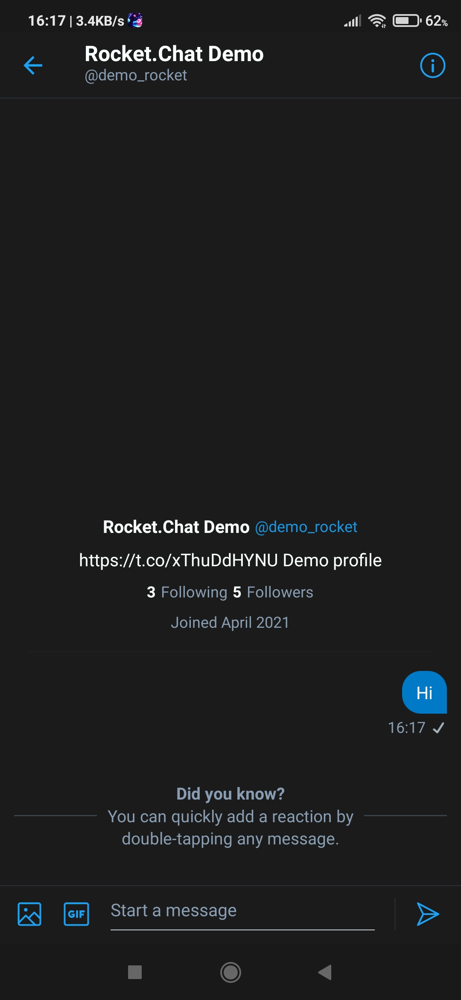

# Twitter App Agent's Guide

If you have Twitter app integration in place and a user sends you a message using their Twitter account, as shown below:

it appears in your Rocket.Chat workspace just like any other omnichannel conversation.

 Click **Take It!** to serve this conversation. You can also send to and receive files from your Twitter end-user, as shown below:

