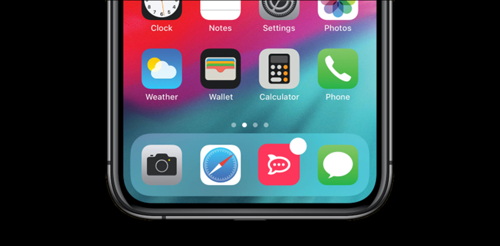

# Brand Usage Examples

### Examples

Below are some examples of how to use the new Rocket.Chat brand from online applications to offline. Be sure to maintain consistency in the application of all elements of the brand.

### Brand in use

.png>)

.png>)

.png>)

.png>)

 (1).png>)

.png>)

 (1).png>)
