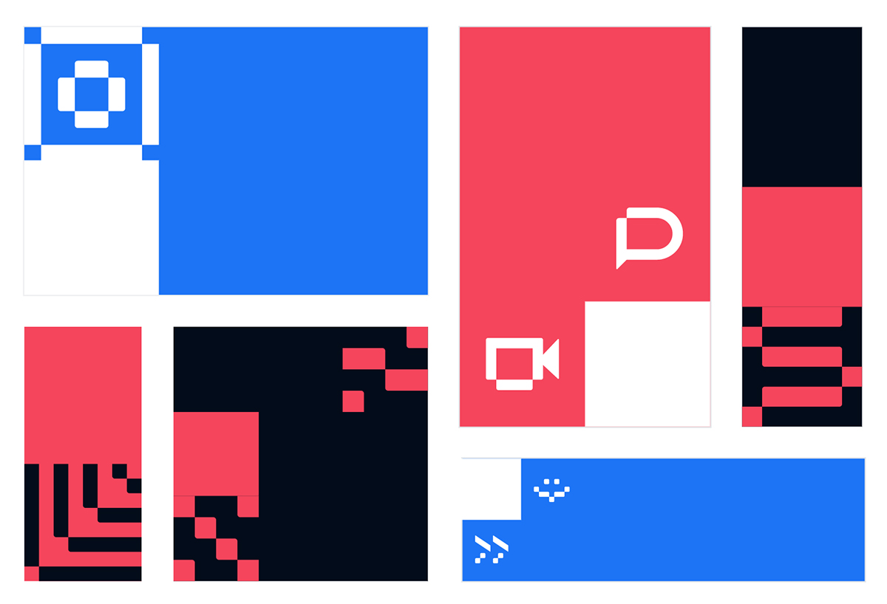
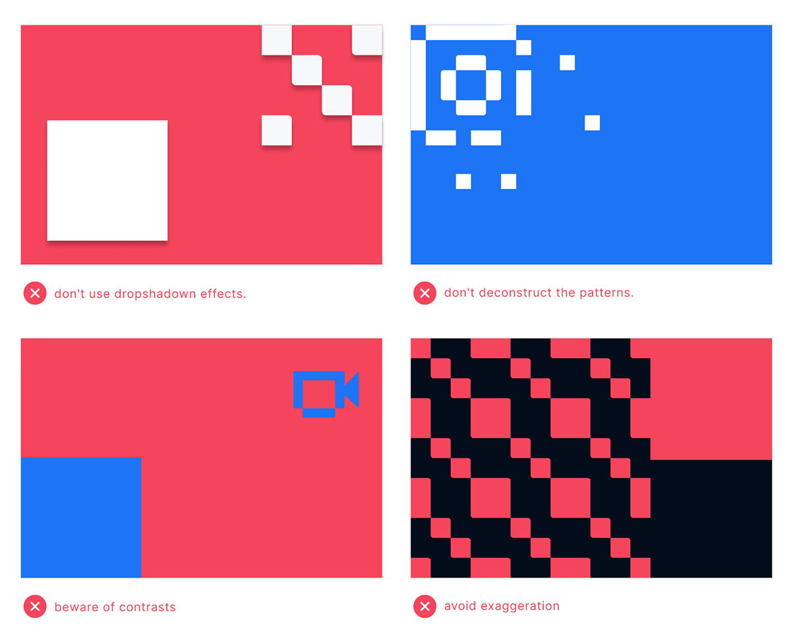

# Compositionsed

Our identity system is modular, inspired by the open source concept. Regardless of the format, the patterns or pixel icons fit together, resulting in a simple system to assemble and easy to reproduce. Below are some examples of the use of modules in the construction of layouts from on to offline layouts.

## Dont's

