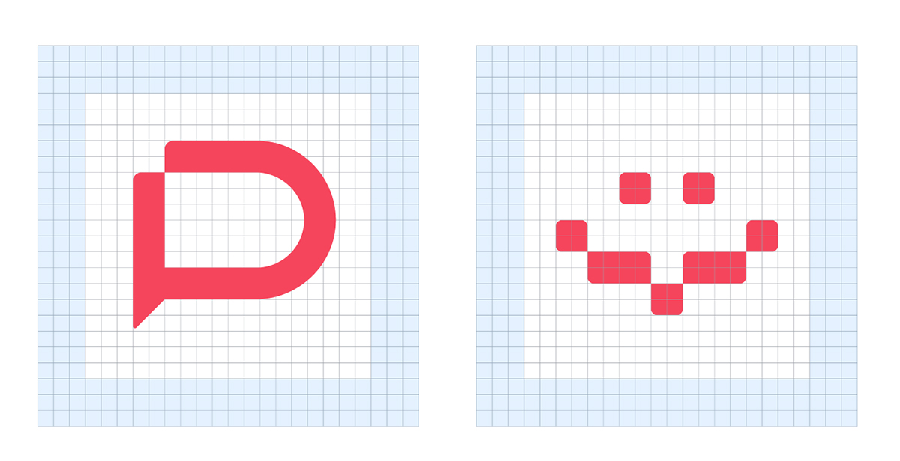
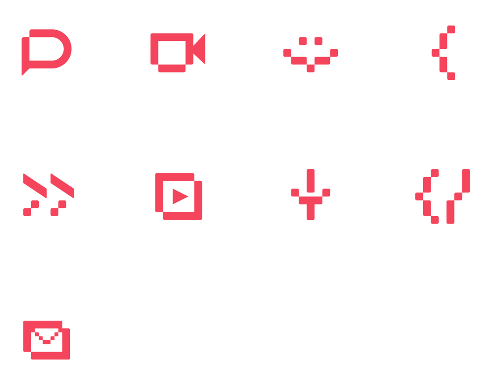

# Iconography

An icon must be a simple and direct graphic representation of the product, service or functions, such as actions and signage. Besides being very functional, it is a powerful tool for building our brand.

The Rocket.chat icons translate the path between digital and physical. Used to convey our personality at all of our touch points.

## Producing an icon

Use the grid below to build new icons within the language Rocket.chat visual. Our grid is simple and functional, always calculating 2 in 2. Below, examples of grid for icons of 24px by 24 px.

## More icons

