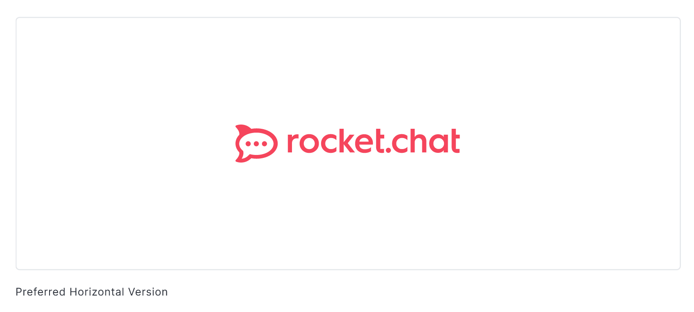
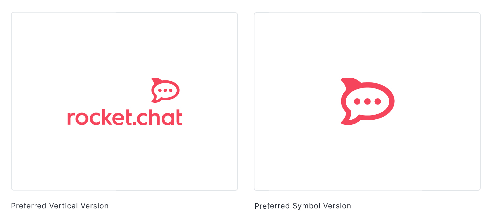
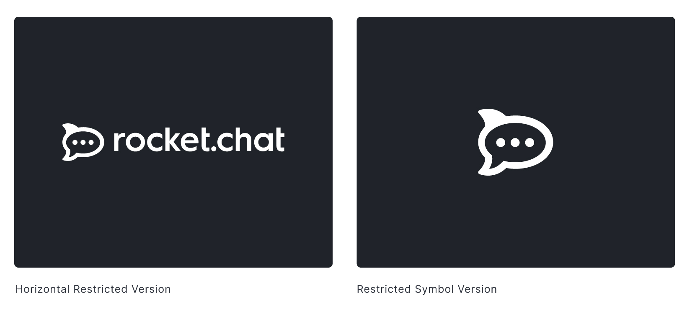
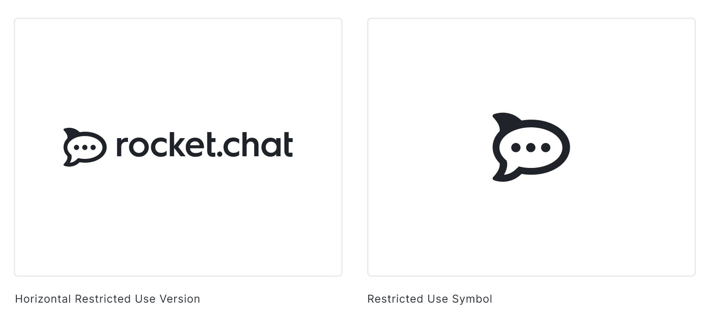
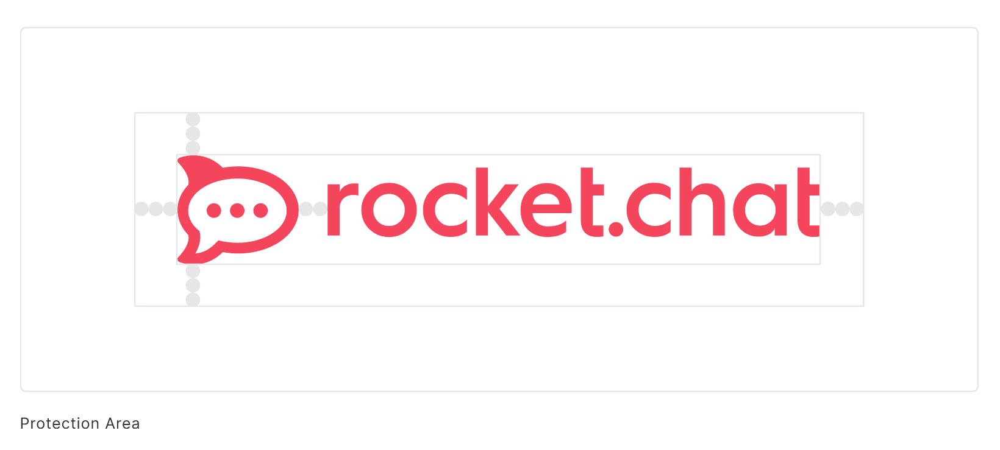

# Logo

The logo is one of the main resources to identify Rocket.Chat. So, use it consistently and coherent is fundamental to strengthen the brand image.

### Protection area

The proximity to other elements can reduce the visual impact of the logo. When applying any of the versions, an area of non-interference around the logo must be protected, equivalent to at least 3 balls from our symbol.

### Position in icons

Whenever placing the Rocket.Chat symbol in circular or square formats, use the circle in the center of our symbol as a reference for centering.

