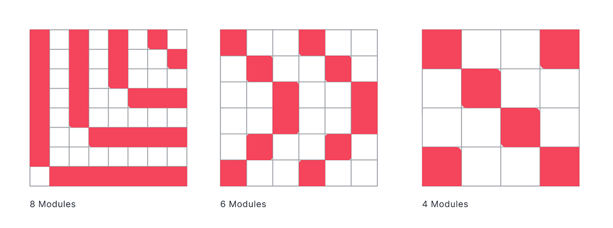
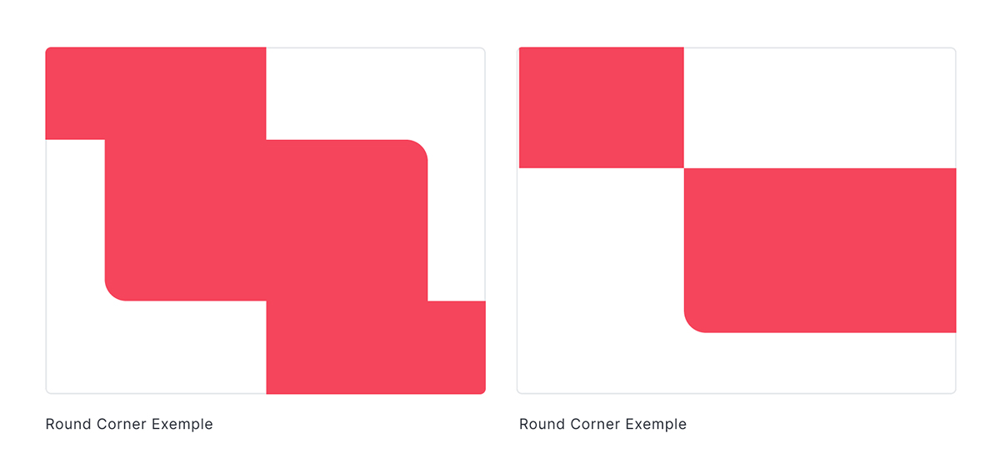
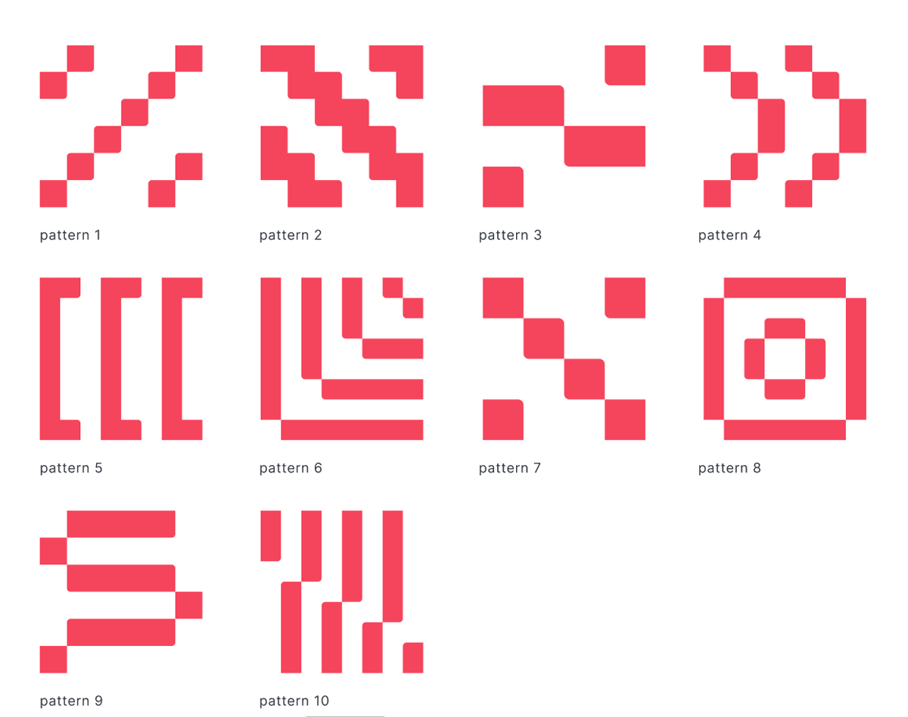

# Patterns

Our pattern style starts from pixel repetition within a modular grid. It is an important element for decorative use at all points of contact.

### Producing a pattern

Use the grid below to build new patterns within the language Rocket.chat visual. Our grid is simple and functional, always calculating 2 in 2. Below, examples of pattern grids of 8 modules, 6 modules and 4 modules.

### Rounded corners

**Watch out!** There are some rounded corners in our patterns keeping the calculation in 2 according to the module size that it was built in.

### More patterns

