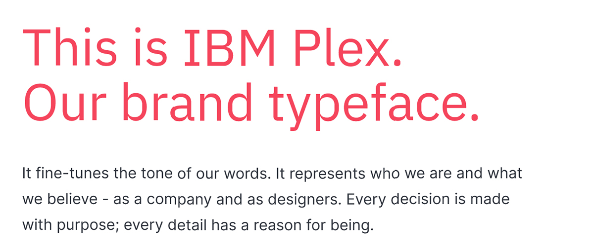
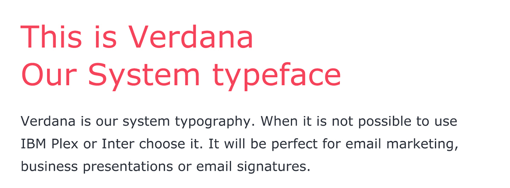
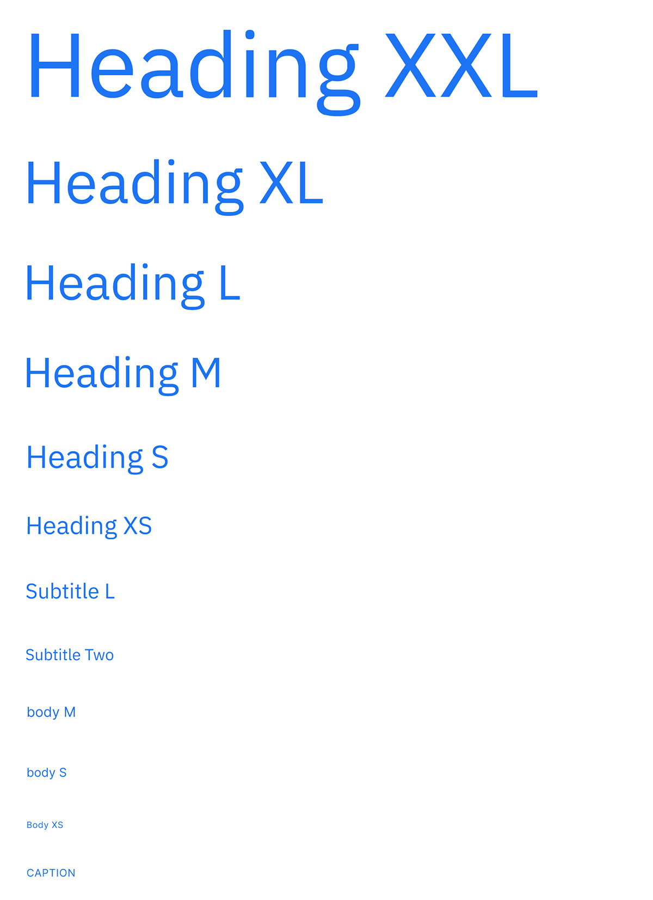
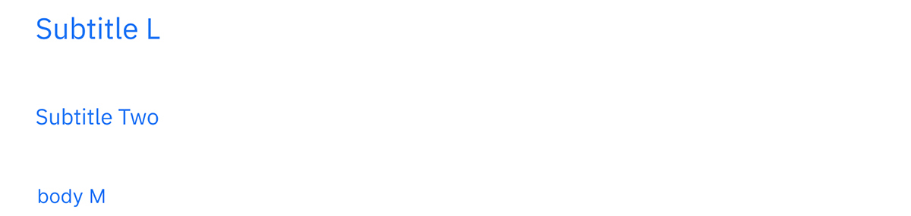
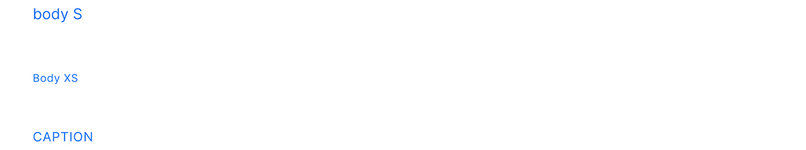

# Typography

The Rocket.Chat typeface family brings flexibility and recognition. Its primary function is to have a fluid performance in the digital medium. Its unique design also helps to highlight aspects such as modernity, technology and simplicity.

### Type Scale

We follow a 6px baseline grid for achieving a vertical rhythm on all block-level elements in the app.

