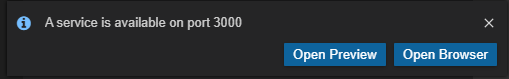

# Contributors instant start on Gitpod

If you are contributing to Rocket.Chat and will likely be working less than 50 hours a month on it, the quickest way to get started is via Gitpod.

## Rocket.Chat Everywhere Development Environment on Gitpod

Gitpod runs a shared environment SaaS for developers working on open source projects. Please be respectful of other developers' need and support Gitpod on their commercial side if you are able to.

Gitpod hosts the entire development environment and you will be able to contribute to Rocket.Chat wherever and whenever you have access to a browser; even from Internet Cafes and Chromebooks.

### Step by step

Go to [https://gitpod.io](https://www.gitpod.io/#get-started) and enter the Rocket.Chat Github project URL

[https://github.com/RocketChat/Rocket.Chat](https://github.com/RocketChat/Rocket.Chat)

\(you can also supply your Github fork of Rocket.Chat here\)


Start your workspace, linking it to your Github account if necessary.

A workspace will be created and loaded with familiar Visual Studio Code environment.

Next, start a terminal in your workspace. And install meteor.

```text
gitpod /workspace/Rocket.Chat $ curl https://install.meteor.com/ | sh
```

There will be warning messages, you do not have and do not need sudo \(root access\) on Gitpod. Next, add the newly installed meteor to your path.

```text
gitpod /workspace/Rocket.Chat $ PATH=$PATH:/home/gitpod/.meteor
```

Finally, install the node dependencies and start your server.

```text
gitpod /workspace/Rocket.Chat $ meteor npm i
```

```text
gitpod /workspace/Rocket.Chat $ meteor npm start
```

After a few minutes, your development environment should be up and running.


Once the server starts, you will see a popup window indicating that your server is running on port 3000. Click the **Open Browser** button to view and interact with your Rocket.Chat server instance.



You can modify the code in Visual Studio Code and see the changes immediately on the server instance thanks to hot code reload.

Start contributing to Rocket.Chat!

