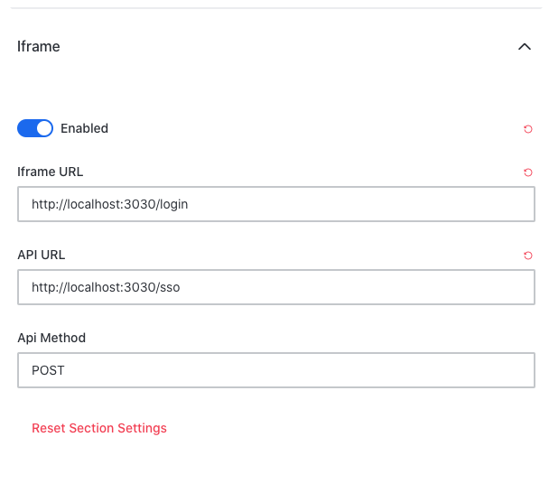
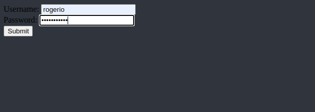

# Testing the iFrame Authentication

This article will describe how to test the iFrame authentication, using a test tool developed by Rocket.Chat team. This test scenario is based in a localhost environment.

## Step 1

Download and start the _iframe-auth-example_ test service following the steps mentioned [here](https://github.com/RocketChat/iframe-auth-example)

The test service code can be used as an example on how to setup the iFrame auth calls to Rocket.Chat. Code is available [here](https://github.com/RocketChat/iframe-auth-example/blob/master/index.js).

## Step 2

Configure Rocket.Chat server \(_Administration &gt; Accounts &gt; iFrame_\) as follows:

## Step 3

Test the iFrame service by calling Rocket.Chat login URL \(in this example, [http://localhost:3000\](http://localhost:3000\)_\)_

In this moment, the _iframe-auth-example_ service runs and the iframe authentication calls are executed.

By default, the test service code expects the login to be done with the following credentials \(harcoded\)  
`username: new-user`  
`password: new-users-passw0rd`

Change the `currentUsername` \(line 105\) to `true` so you can login again with the same user. By changing the code you may use any user which already exists in Rocket.Chat

Further reference can be found [here](https://github.com/RocketChat/Rocket.Chat.ReactNative/pull/2184).

