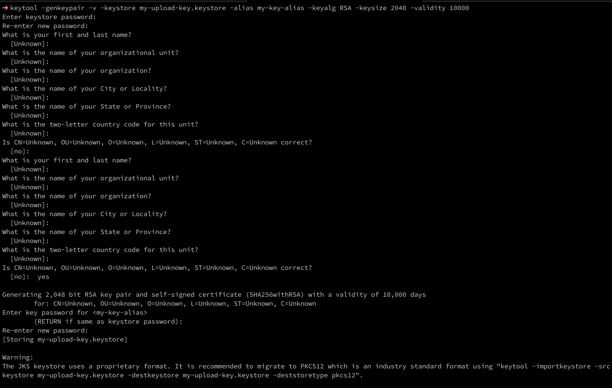
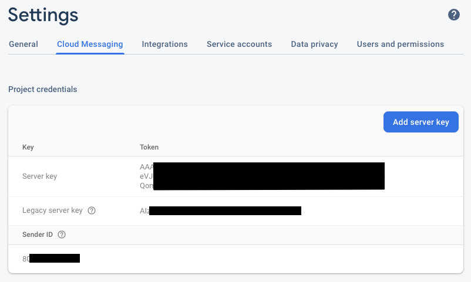
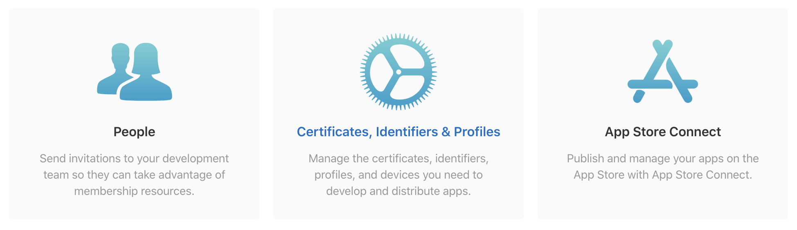
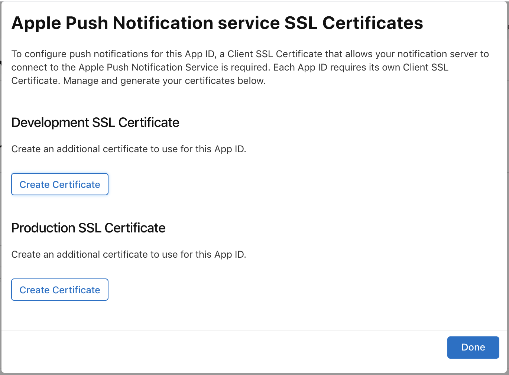

# Whitelabeling mobile apps

In this guide we will cover how to rebrand Rocket.Chat Mobile Apps to suit your styling.

Here we will show you how to customize:

* The App Icons
* Splash Screens
* App Name
* Some colors

Before starting, keep in mind that you will need an intermediate knowledge of Android/iOS development and basic Javascript knowledge.

## Repo

* Make sure you have both iOS and Google developer accounts and the respective development environments working
  * You can follow this guide: [https://reactnative.dev/docs/getting-started](https://reactnative.dev/docs/getting-started)
* Clone [https://github.com/RocketChat/Rocket.Chat.ReactNative](https://github.com/RocketChat/Rocket.Chat.ReactNative)
* Checkout `single-server` branch

## General

* Create an account on [https://www.bugsnag.com/](https://www.bugsnag.com/)
* Set `BUGSNAG_API_KEY` on [config.js](https://github.com/RocketChat/Rocket.Chat.ReactNative/blob/single-server/config.js#L2)
* Set `server`, `appGroup` and `appStoreId` on [app.json](https://github.com/RocketChat/Rocket.Chat.ReactNative/blob/single-server/app.json#L5)
  * `appGroup` must be the same App Group created for the iOS app
* Change app colors on [colors.js](https://github.com/RocketChat/Rocket.Chat.ReactNative/blob/single-server/app/constants/colors.js)

## Firebase

### Creating a new project on Google Cloud Platform

* Visit [https://console.cloud.google.com/home/dashboard](https://console.cloud.google.com/home/dashboard)
* By the text Google Cloud Platform there is a dropdown, open and then “Create project”
* In the dialog give an project name then “Create”
* Wait the creating process, you can follow in notifications by your avatar
* You will be redirected to the project page after creation

### Creating new Firebase project

* Visit [https://console.firebase.google.com/](https://console.firebase.google.com/)
* Click on “Add Project”
* Enter the project name you created on previous step
* Follow the wizard until Firebase project is created
* We’re going to create the apps later on the tutorial

## iOS

### General setup

* Open [RocketChatRN.xcworkspace](https://github.com/RocketChat/Rocket.Chat.ReactNative/tree/single-server/ios/RocketChatRN.xcworkspace) on Xcode \(11.3.1 or newer\)
* On General tab, select “RocketChatRN” and change Display Name, Bundle Identifier, Version and Build

* Select “ShareRocketChatRN” and change the same properties
  * Note: Bundle Identifier is different from the previous target

* On Signing and Capabilities, check “Automatically manage signing” and select your app group

* Select “ShareRocketChatRN” and check “Automatically manage signing”

* Set the same app group on RocketChatRN/Info.plist and ShareRocketChatRN/Info.plist

* Change the app icon on Images.xcassets/App Icon

* Change the app splash screen on Images.xcassets/Launch Screen Icon

* Set your Bugsnag API key on RocketChatRN/Info.plist

### Generating iOS app on Firebase

* Visit the project overview on [https://console.firebase.google.com](https://console.firebase.google.com)
* Click on the gear icon and then “Project settings”

* On “General” tab, click on “iOS” button under “Your apps” section

* Enter your bundle ID and then “Register app”

* Download config file and move it as instructed

* Move the file to “ShareRocketChatRN” folder as well

### Running the app

* Execute the following on project terminal
  * `yarn`
  * `cd ios`
  * `pod install`
  * `cd ..`
  * `react-native run-ios`

## Android

### General setup

* Set `APPLICATIONID`, `VERSIONNAME`, `VERSIONCODE` and `BugsnagAPIKey` on [./android/gradle.properties](https://github.com/RocketChat/Rocket.Chat.ReactNative/blob/single-server/android/gradle.properties)
* Change `ic_launcher.png` and `ic_notification.png` on the folders [./android/app/src/main/res/mipmap\*](https://github.com/RocketChat/Rocket.Chat.ReactNative/tree/single-server/android/app/src/main/res)

### 

* Change [./android/app/src/main/res/drawable-xxxhdpi/splash.png](https://github.com/RocketChat/Rocket.Chat.ReactNative/blob/single-server/android/app/src/main/res/drawable-xxxhdpi/splash.png)
* Change `strings/app_name` and `strings/share_extension_name` on [./android/app/src/main/res/values/strings.xml](https://github.com/RocketChat/Rocket.Chat.ReactNative/blob/single-server/android/app/src/main/res/values/strings.xml)

### Generate upload key

* This step will generate the keystore that is going to verify your app on Google Play
  * You can use this guide as reference: [https://reactnative.dev/docs/signed-apk-android\#generating-an-upload-key](https://reactnative.dev/docs/signed-apk-android#generating-an-upload-key)
* Execute the following on terminal
  * `cd android/app`
  * `keytool -genkeypair -v -keystore my-upload-key.keystore -alias my-key-alias -keyalg RSA -keysize 2048 -validity 10000`
* Credentials will be prompted

* Set `KEYSTORE_PASSWORD` and `KEY_PASSWORD` on [./android/gradle.properties](https://github.com/RocketChat/Rocket.Chat.ReactNative/blob/single-server/android/gradle.properties) with the passwords you were prompted

### Generating Android app on Firebase

* Visit the project overview on [https://console.firebase.google.com](https://console.firebase.google.com)
* Click on the gear icon and then “Project settings”

* On “General” tab, click on “Add app” button under “Your apps” section and then “Android”

* Enter your bundle ID and then “Register app”

* Download config file and move it as instructed

### Running the app

* Execute the following on project terminal
  * `yarn`
  * `react-native run-android`
* The app will build on the simulator or device, but it won’t start automatically

### Optional: Start the app automatically after build

* Android starts the app based on package’s Activity, but we changed the application id, so it won’t work
* For it to work, you have to change all references to `chat.rocket.reactnative` on `.java` files and on manifest
* Change all references as on this commit: [https://github.com/RocketChat/Rocket.Chat.ReactNative/commit/518e56379d88937d7f9a572c7bd61716a4d0b7fe](https://github.com/RocketChat/Rocket.Chat.ReactNative/commit/518e56379d88937d7f9a572c7bd61716a4d0b7fe)

## Push notification

### Configuring gateway

* Go to your Rocket.Chat admin page &gt; Push
* Disable “Gateway” and press “Save changes”

* Also disable “Production”, if you’re trying in debug mode
* Expand “Credentials and Keys” section

### Configuring Android

* Go to Cloud Messaging on Firebase settings
* Copy “Server Key” token from Firebase into “GCM API Key”
* Copy “Sender ID” into “GCM Project Number”

### Configuring iOS

* Make sure you’ve done “Creating Push Notifications certificates” first
* In your terminal, go to the folder which contains your push files \(CSR, .cer, .p12\).

#### Generating PEM files \(Development\)

* Execute
  * `openssl x509 -in aps_development.cer -inform der -out DevPushCert.pem`
  * `openssl pkcs12 -nocerts -out DevPushKey.pem -in yourP12File.p12`
* You **must** set a password for your PEM file

#### Generating PEM files \(Production\)

* Execute
  * `openssl x509 -in aps.cer -inform der -out PushCert.pem`
  * `openssl pkcs12 -nocerts -out PushKey.pem -in yourP12File.p12`
* You **must** set a password for your PEM file

#### Copying PEM files to Rocket.Chat

* Copy the contents of your development PEM files and password into APN Dev Key, APN Dev Cert and APN Dev Passphrase
* Copy the contents of your production PEM files and password into APN Key, APN Cert and APN Passphrase
* You can use `cat` on terminal to get the content of your PEM files
  * `cat PushKey.pem`
* Save and restart your server
* Log into the server as the same user on your mobile device and close it \(it won’t receive push notification, if it’s open\)
* Open Push settings on admin from desktop and click “Send a test push to my user”

## Developer Apple

### Login to Apple Developer

* Visit [https://developer.apple.com/account](https://developer.apple.com/account/resources/certificates/list)
* Enter your credentials
* Click on Certificates, Identifiers & Profiles

### Creating an App Identifier

* Visit [https://developer.apple.com/account/resources/identifiers/list](https://developer.apple.com/account/resources/identifiers/list)
* Click to add Identifier
* Select App IDs and Continue

* Add description and Bundle ID

* On Capabilities, select App Groups and Push notifications
* Click “Continue” and then “Register”

### Creating an App Identifier for our Share Extension

* Share Extension is a version of the app that opens when you share data from another app to Rocket.Chat. For example, share a photo from the gallery.
* Visit [https://developer.apple.com/account/resources/identifiers/list](https://developer.apple.com/account/resources/identifiers/list)
* Click to add Identifier
* Select App IDs and Continue

* Add description and Bundle ID

* This time, select only App Groups under Capabilities
* Click “Continue” and then “Register”

### Creating an App Group

* Visit [https://developer.apple.com/account/resources/identifiers/list](https://developer.apple.com/account/resources/identifiers/list)
* Click to add Identifier
* Select App Groups and Continue

* Enter a description and an Identifier

* Click “Continue” and then “Register”

### Applying App Group

* Visit [https://developer.apple.com/account/resources/identifiers/list](https://developer.apple.com/account/resources/identifiers/list)
* Click on the first identifier you created
* On “App Groups”, click “Configure”
* Select the App Group you created and click “Continue”
* Click “Save”
* Repeat these steps for the second identifier you created for the Share Extension

### Creating Push Notifications certificates

* Visit [https://developer.apple.com/account/resources/identifiers/list](https://developer.apple.com/account/resources/identifiers/list)
* Click on the first identifier you created
* On “Push Notifications”, click “Configure”

#### 

#### Development SSL Certificate

* On “Development SSL Certificate”, click “Create Certificate”
* Follow Apple’s tutorial to generate a Certificate Signing Request: [https://help.apple.com/developer-account/\#/devbfa00fef7](https://help.apple.com/developer-account/#/devbfa00fef7)
* Select the certificate you created an click “Continue”

* Download the certificate and install it on your machine \(follow instructions on the screen\)

* After installing it, “Keychain Access” should have opened automatically on your Mac
* Export the certificate to generate a .p12 file

* For simplicity, save it in the same folder of your CSR and .cer. You’ll need it later.

#### Production SSL Certificate

* On “Production SSL Certificate”, click “Create Certificate”
* Follow Apple’s tutorial to generate a Certificate Signing Request: [https://help.apple.com/developer-account/\#/devbfa00fef7](https://help.apple.com/developer-account/#/devbfa00fef7)
* Select the certificate you created an click “Continue”

* Download the certificate and install it on your machine \(follow instructions on the screen\)

* After installing it, “Keychain Access” should have opened automatically on your Mac
* Export the certificate to generate a .p12 file

* For simplicity, save it in the same folder of your CSR and .cer. You’ll need it later.

